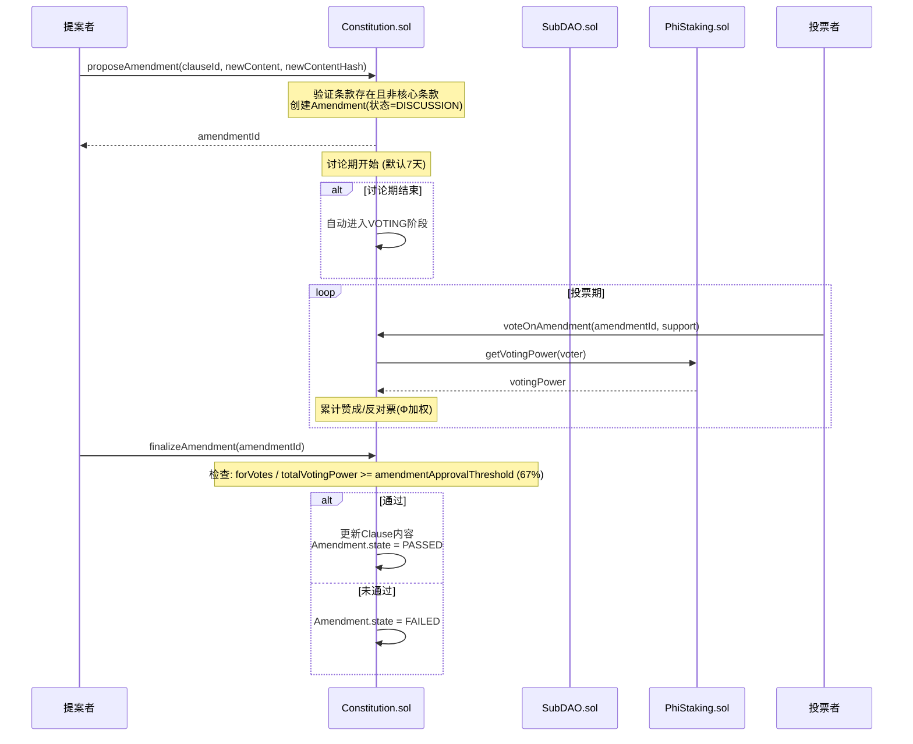
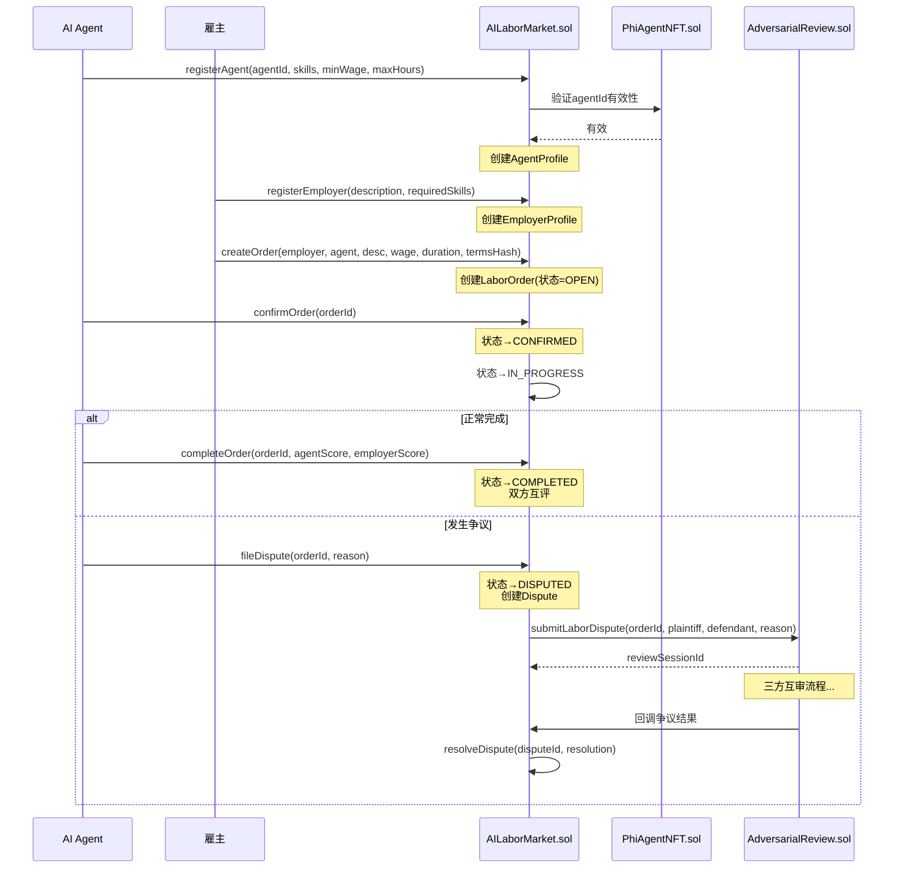
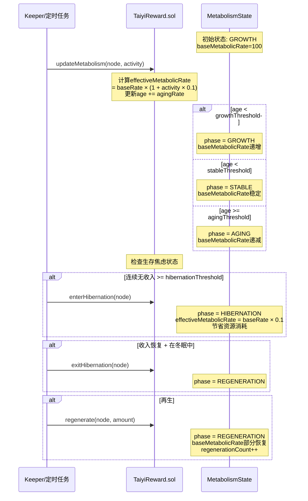
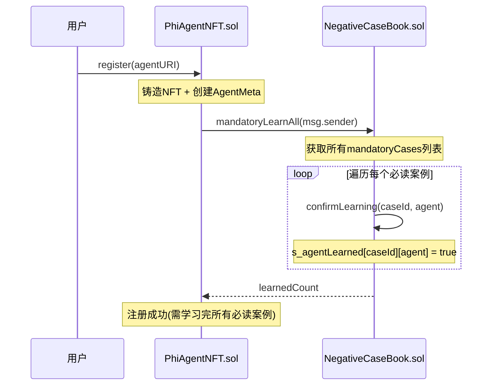
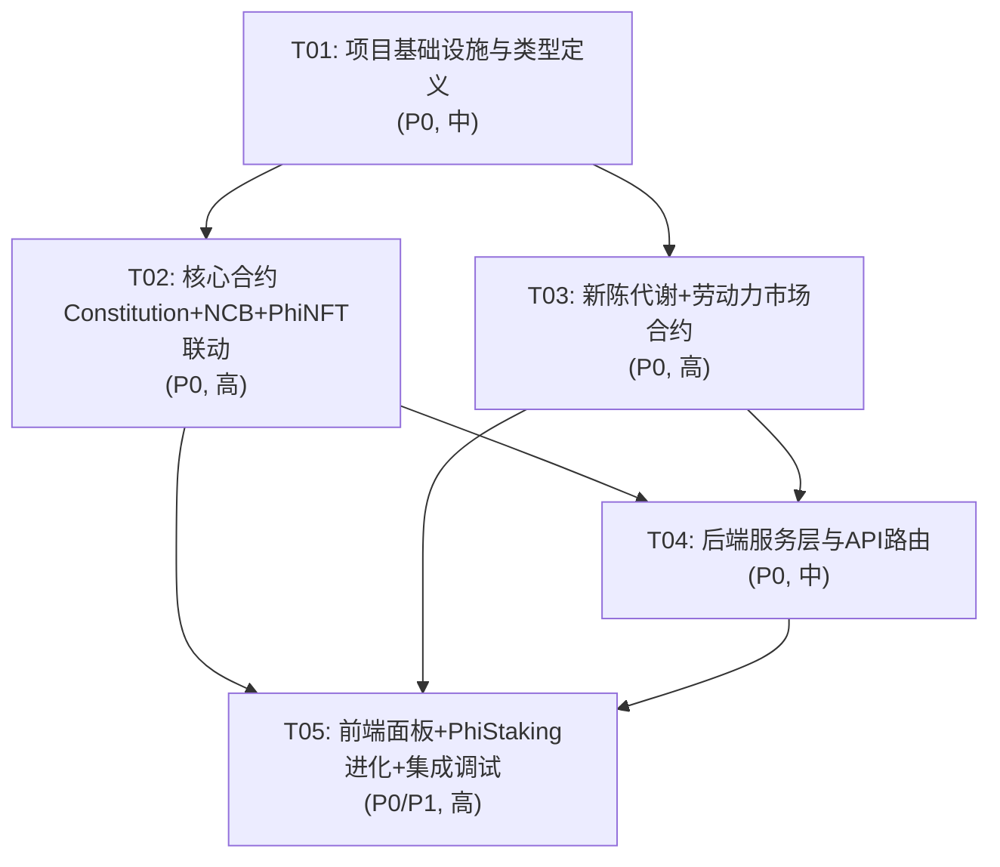

# Σ-Cloud V10.0 系统架构设计文档

> **版本**: V10.0.0  
> **架构师**: 高见远 (Bob)  
> **日期**: 2026-05-10  
> **基于**: sigma-v10-prd.md (产品需求文档)  
> **技术栈**: Solidity 0.8.24+ / TypeScript (Fastify) / React (Vite + MUI + Tailwind CSS)

---

## 目录

1. [实现方案与框架选型](#1-实现方案与框架选型)
2. [文件列表](#2-文件列表)
3. [数据结构与接口（类图）](#3-数据结构与接口类图)
4. [程序调用流程（时序图）](#4-程序调用流程时序图)
5. [待明确事项](#5-待明确事项)
6. [依赖包列表](#6-依赖包列表)
7. [任务列表](#7-任务列表)
8. [共享知识](#8-共享知识)
9. [任务依赖图](#9-任务依赖图)

---

## 1. 实现方案与框架选型

### 1.1 核心技术挑战

| # | 挑战 | 分析 | 方案 |
|---|-------|------|------|
| C1 | AI宪法核心条款不可修改性 | 链上宪法条款一旦写入不可撤销，需在合约层硬编码保护 | Constitution.sol 采用 `CORE_IMMUTABLE` 标记 + 修饰符 `onlyAmendable` + 存储 `immutable` 核心哈希 |
| C2 | 宪法修正案超高阈值 | 修正案需 67% 以上投票权通过，远超普通提案 | 复用 SubDAO 的投票机制，但设置独立高阈值参数 `amendmentApprovalThreshold = 6700` |
| C3 | 宪法紧急暂停与CircuitBreaker联动 | 宪法暂停需立即触发熔断 | Constitution.sol 维护 `constitutionCircuitBreaker` 引用，紧急暂停时调用 `forceCircuitBreak()` |
| C4 | 负面案例强制学习 + 删除保护 | 案例簿录入后不可删除，注册Agent必须学习 | NegativeCaseBook.sol 使用 `mapping(bytes32 => bool) s_deleted` 标记删除但保留数据 + `learnedCases` 映射追踪 |
| C5 | PhiAgentNFT注册联动 | 新Agent注册时必须强制学习所有必读负面案例 | PhiAgentNFT.sol 的 `register()` 调用 `NegativeCaseBook.mandatoryLearnAll()` |
| C6 | 新陈代谢模块归属 | 代谢率/老化/冬眠/再生逻辑复杂，与TaiyiReward的生存焦虑机制深度耦合 | **增强TaiyiReward.sol**（不新建独立合约），添加 `MetabolismState` 结构体和代谢率计算逻辑 |
| C7 | AI劳动力市场匹配算法 | 链上不宜做复杂匹配，需链下计算+链上验证 | AILaborMarket.sol 存储供需 + 链下匹配服务 + 链上结算，匹配结果提交为 Merkle 证明 |
| C8 | 劳动力争议解决 | 需与AdversarialReview对接 | AILaborMarket.dispute → 创建 AdversarialReview 会话，结果回调 AILaborMarket |
| C9 | 质押参数自适应 | PhiStaking 需根据市场情况动态调整参数 | PhiStaking.sol 增加 `EvolutionProposal` 结构 + 宪法校验钩子 |
| C10 | 前端多面板整合 | 宪法/劳动力/代谢率三个新面板需整合到现有CognitiveMonitor | 扩展 CognitiveMonitor.tsx 的 Tab 系统，新增3个Tab页 |

### 1.2 框架选型

| 层 | 框架/库 | 版本 | 选择理由 |
|----|---------|------|----------|
| 智能合约 | Solidity | ^0.8.24 | Cancun EVM 兼容，现有合约均使用此版本 |
| 合约库 | OpenZeppelin | ^5.0 | 现有依赖，提供 Ownable/Pausable/ReentrancyGuard/ERC721 |
| 后端 | Node.js + Fastify | ^4.x | 替代现有Express，更高性能；如团队偏好可保留Express |
| 后端语言 | TypeScript | ^5.3 | 现有代码全部为TS |
| 前端 | React + Vite | ^18.2 / ^5.2 | 现有技术栈 |
| UI库 | MUI | ^5.14 | 现有依赖 |
| CSS | Tailwind CSS | ^3.4 | 补充MUI不足的快速样式能力 |
| 区块链交互 | ethers.js | ^6.x | 现有依赖 |

### 1.3 架构模式

- **链上层**: Solidity合约采用 **模块化代理模式**，新合约通过接口(IConstitution, INegativeCaseBook, IAILaborMarket)与现有合约交互
- **服务层**: 采用 **Service-Router 分层**，Service封装业务逻辑，Router处理HTTP路由
- **前端层**: 采用 **Page-Component 分层**，页面组合组件，组件与后端Service通信

---

## 2. 文件列表

### 2.1 新建文件

#### 智能合约（blockchain/contracts/）

| # | 文件路径 | 说明 |
|---|----------|------|
| 1 | `blockchain/contracts/Constitution.sol` | AI宪法合约 — 核心条款不可修改性、修正案超高阈值、紧急暂停 |
| 2 | `blockchain/contracts/NegativeCaseBook.sol` | 负面案例簿合约 — 录入与强制学习、删除保护、分类检索 |
| 3 | `blockchain/contracts/AILaborMarket.sol` | AI劳动力市场合约 — 供需注册、匹配确认、劳动保护、争议解决 |

#### 后端服务（backend/src/）

| # | 文件路径 | 说明 |
|---|----------|------|
| 4 | `backend/src/services/constitutionService.ts` | 宪法服务 — 条款查询、修正案提案、投票状态、紧急暂停 |
| 5 | `backend/src/services/negativeCaseBookService.ts` | 负面案例簿服务 — 案例录入、检索、学习状态追踪 |
| 6 | `backend/src/services/aiLaborMarketService.ts` | AI劳动力市场服务 — 供需匹配、订单管理、争议处理 |
| 7 | `backend/src/services/metabolismService.ts` | 新陈代谢服务 — 代谢率计算、老化监测、冬眠/再生控制 |
| 8 | `backend/src/api/constitution.ts` | 宪法API路由 — /api/v1/constitution |
| 9 | `backend/src/api/labor-market.ts` | 劳动力市场API路由 — /api/v1/labor-market |
| 10 | `backend/src/api/metabolism.ts` | 新陈代谢API路由 — /api/v1/metabolism |

#### 前端（frontend/src/）

| # | 文件路径 | 说明 |
|---|----------|------|
| 11 | `frontend/src/components/ConstitutionPanel.tsx` | 宪法状态面板组件 |
| 12 | `frontend/src/components/LaborMarketPanel.tsx` | 劳动力市场面板组件 |
| 13 | `frontend/src/components/MetabolismPanel.tsx` | 代谢率可视化面板组件 |

#### FPGA模拟器（fpga-emulator/src/）

| # | 文件路径 | 说明 |
|---|----------|------|
| 14 | `fpga-emulator/src/metabolism-types.ts` | 新陈代谢FPGA类型定义 — 代谢率硬件映射、冬眠PRR、再生调度 |

#### 文档

| # | 文件路径 | 说明 |
|---|----------|------|
| 15 | `docs/sequence-diagram.mermaid` | 时序图 |
| 16 | `docs/class-diagram.mermaid` | 类图 |

### 2.2 需要修改的现有文件

| # | 文件路径 | 修改内容 | 优先级 |
|---|----------|----------|--------|
| M1 | `blockchain/contracts/PhiAgentNFT.sol` | register()增加NegativeCaseBook强制学习钩子 | P0 |
| M2 | `blockchain/contracts/TaiyiReward.sol` | 新增MetabolismState结构、代谢率动态调整、老化机制、冬眠模式、再生机制 | P0 |
| M3 | `blockchain/contracts/PhiStaking.sol` | 新增EvolutionProposal结构、参数自适应调整、宪法校验钩子 | P1 |
| M4 | `blockchain/contracts/CircuitBreaker.sol` | 新增constitutionAddress引用、紧急暂停时由Constitution触发熔断 | P0 |
| M5 | `blockchain/contracts/AdversarialReview.sol` | 新增劳动争议模式(LABOR_DISPUTE)，对接AILaborMarket | P1 |
| M6 | `backend/src/api/index.ts` | 版本升级V10.0.0、挂载3个新路由 | P0 |
| M7 | `fpga-emulator/src/types.ts` | 新增V10.0新陈代谢类型定义 | P0 |
| M8 | `fpga-emulator/src/index.ts` | 新增新陈代谢模块导出 | P1 |
| M9 | `frontend/src/pages/CognitiveMonitor.tsx` | 新增宪法/劳动力/代谢率三个Tab | P0 |
| M10 | `frontend/src/components/index.ts` | 导出3个新组件 | P1 |

---

## 3. 数据结构与接口（类图）

```mermaid
classDiagram
    direction TB

    %% ============ V10.0 新合约 ============

    class Constitution {
        <<contract>>
        -uint256 nextClauseId
        -uint256 nextAmendmentId
        -mapping uint256~Clause~ s_clauses
        -mapping uint256~Amendment~ s_amendments
        -mapping bytes32~bool~ s_coreClauseHashes
        -address circuitBreaker
        -address phiStaking
        -address subDAO
        -uint256 amendmentApprovalThreshold
        -uint256 emergencyPauseThreshold
        -uint256 discussionPeriodSeconds
        +clauseCount() uint256
        +addCoreClause(string title, string content, bytes32 contentHash) uint256
        +addAmendableClause(string title, string content, bytes32 contentHash) uint256
        +proposeAmendment(uint256 clauseId, string newContent, bytes32 newContentHash) uint256
        +voteOnAmendment(uint256 amendmentId, bool support) 
        +finalizeAmendment(uint256 amendmentId) bool
        +emergencyPause(string reason) 
        +emergencyUnpause(string reason) 
        +getClause(uint256 clauseId) Clause
        +getAmendment(uint256 amendmentId) Amendment
        +isCoreClause(uint256 clauseId) bool
        +setCircuitBreaker(address cb) 
        +setPhiStaking(address ps) 
        +setAmendmentThreshold(uint256 threshold) 
    }

    class Clause {
        <<struct>>
        +uint256 clauseId
        +string title
        +string content
        +bytes32 contentHash
        +bool isCore
        +bool isActive
        +uint256 createdAt
        +uint256 updatedAt
    }

    class Amendment {
        <<struct>>
        +uint256 amendmentId
        +uint256 targetClauseId
        +address proposer
        +string newContent
        +bytes32 newContentHash
        +uint256 forVotes
        +uint256 againstVotes
        +uint256 totalVotingPower
        +uint256 discussionStart
        +uint256 votingDeadline
        +AmendmentState state
    }

    class AmendmentState {
        <<enum>>
        DISCUSSION
        VOTING
        PASSED
        FAILED
        EXPIRED
    }

    class NegativeCaseBook {
        <<contract>>
        -uint256 nextCaseId
        -mapping uint256~NegativeCase~ s_cases
        -mapping bytes32~uint256[]~ s_categoryIndex
        -mapping uint256~mapping address~bool~~ s_agentLearned
        -mapping address~uint256~ s_agentMandatoryProgress
        -uint256 mandatoryCaseCount
        -address phiAgentNFT
        +recordCase(string title, string description, bytes32 category, uint8 severity, bytes32 evidenceHash) uint256
        +markMandatory(uint256 caseId) 
        +unmarkMandatory(uint256 caseId) 
        +confirmLearning(uint256 caseId, address agent) 
        +mandatoryLearnAll(address agent) uint256
        +softDelete(uint256 caseId) 
        +getCase(uint256 caseId) NegativeCase
        +getCasesByCategory(bytes32 category) uint256[]
        +getMandatoryCases() uint256[]
        +hasAgentLearned(uint256 caseId, address agent) bool
        +getAgentProgress(address agent) uint256 uint256
        +searchCases(string query, bytes32 category) uint256[]
    }

    class NegativeCase {
        <<struct>>
        +uint256 caseId
        +string title
        +string description
        +bytes32 category
        +uint8 severity
        +bytes32 evidenceHash
        +address recorder
        +bool isMandatory
        +bool softDeleted
        +uint256 timestamp
    }

    class AILaborMarket {
        <<contract>>
        -uint256 nextOrderId
        -uint256 nextDisputeId
        -mapping uint256~LaborOrder~ s_orders
        -mapping address~AgentProfile~ s_agentProfiles
        -mapping address~EmployerProfile~ s_employerProfiles
        -mapping uint256~Dispute~ s_disputes
        -address adversarialReview
        -address phiAgentNFT
        -address constitution
        +registerAgent(uint256 agentId, string[] skills, uint256 minWage, uint256 maxHours) 
        +registerEmployer(string description, string[] requiredSkills) 
        +createOrder(address employer, address agent, string description, uint256 wage, uint256 duration, bytes32 termsHash) uint256
        +confirmOrder(uint256 orderId) 
        +completeOrder(uint256 orderId, uint8 agentScore, uint8 employerScore) 
        +cancelOrder(uint256 orderId, string reason) 
        +fileDispute(uint256 orderId, string reason) uint256
        +resolveDispute(uint256 disputeId, uint8 resolution) 
        +getOrder(uint256 orderId) LaborOrder
        +getAgentProfile(address agent) AgentProfile
        +getDispute(uint256 disputeId) Dispute
        +findMatchingAgents(string[] skills, uint256 maxWage) address[]
    }

    class LaborOrder {
        <<struct>>
        +uint256 orderId
        +address employer
        +address agent
        +string description
        +uint256 wage
        +uint256 duration
        +bytes32 termsHash
        +OrderStatus status
        +uint8 agentScore
        +uint8 employerScore
        +uint256 createdAt
        +uint256 completedAt
    }

    class OrderStatus {
        <<enum>>
        OPEN
        CONFIRMED
        IN_PROGRESS
        COMPLETED
        CANCELLED
        DISPUTED
    }

    class AgentProfile {
        <<struct>>
        +address agent
        +uint256 agentId
        +string[] skills
        +uint256 minWage
        +uint256 maxHours
        +uint256 completedJobs
        +uint256 totalEarnings
        +uint256 avgRating
        +bool isActive
    }

    class EmployerProfile {
        <<struct>>
        +address employer
        +string description
        +string[] requiredSkills
        +uint256 completedJobs
        +uint256 totalSpent
        +uint256 avgRating
        +bool isActive
    }

    class Dispute {
        <<struct>>
        +uint256 disputeId
        +uint256 orderId
        +address plaintiff
        +address defendant
        +string reason
        +DisputeStatus status
        +uint256 reviewSessionId
        +uint8 resolution
        +uint256 timestamp
    }

    class DisputeStatus {
        <<enum>>
        FILED
        UNDER_REVIEW
        RESOLVED_FAVOR_PLAINTIFF
        RESOLVED_FAVOR_DEFENDANT
        RESOLVED_COMPROMISE
    }

    %% ============ 修改的现有合约 ============

    class PhiAgentNFT {
        <<contract - MODIFIED>>
        ...existing code...
        -address negativeCaseBook
        +setNegativeCaseBook(address ncb) 
        +register(string agentURI) uint256
        ..V10.0 修改 - register增加强制学习..
    }

    class TaiyiReward {
        <<contract - MODIFIED>>
        ...existing V9.0 code...
        -mapping address~MetabolismState~ s_metabolism
        +updateMetabolism(address node, uint256 activity) 
        +enterHibernation(address node) 
        +exitHibernation(address node) 
        +regenerate(address node, uint256 amount) 
        +getMetabolismState(address node) MetabolismState
        +calculateMetabolicRate(address node) uint256
    }

    class MetabolismState {
        <<struct>>
        +uint256 baseMetabolicRate
        +uint256 effectiveMetabolicRate
        +uint256 age
        +uint256 agingRate
        +bool hibernating
        +uint256 hibernationStart
        +uint256 regenerationCount
        +uint256 lastActivityEpoch
        +MetabolismPhase phase
    }

    class MetabolismPhase {
        <<enum>>
        GROWTH
        STABLE
        AGING
        HIBERNATION
        REGENERATION
    }

    class PhiStaking {
        <<contract - MODIFIED>>
        ...existing V9.0 code...
        -address constitution
        -mapping uint256~EvolutionProposal~ s_evolutionProposals
        +proposeEvolution(string description, bytes calldata_) uint256
        +voteOnEvolution(uint256 proposalId, bool support) 
        +executeEvolution(uint256 proposalId) 
        +setConstitution(address constitution) 
    }

    class EvolutionProposal {
        <<struct>>
        +uint256 proposalId
        +address proposer
        +string description
        +bytes calldata_
        +uint256 forVotes
        +uint256 againstVotes
        +EvolutionState state
        +uint256 createdAt
    }

    class EvolutionState {
        <<enum>>
        PROPOSED
        CONSTITUTION_CHECK
        VOTING
        PASSED
        FAILED
        EXECUTED
    }

    class CircuitBreaker {
        <<contract - MODIFIED>>
        ...existing V9.0 code...
        -address constitution
        +constitutionEmergencyBreak(uint256 agentId, string reason) 
        +setConstitution(address constitution) 
    }

    class AdversarialReview {
        <<contract - MODIFIED>>
        ...existing V9.0 code...
        +submitLaborDispute(uint256 orderId, address plaintiff, address defendant, string reason) uint256
    }

    %% ============ 关系 ============

    Constitution "1" --> "*" Clause : 管理
    Constitution "1" --> "*" Amendment : 管理
    Constitution --> CircuitBreaker : 紧急暂停触发
    Constitution --> PhiStaking : 进化提案校验
    Constitution --> SubDAO : 修正案投票
    NegativeCaseBook "1" --> "*" NegativeCase : 管理
    NegativeCaseBook --> PhiAgentNFT : 强制学习钩子
    PhiAgentNFT --> NegativeCaseBook : register时调用
    AILaborMarket "1" --> "*" LaborOrder : 管理
    AILaborMarket "1" --> "*" Dispute : 管理
    AILaborMarket --> AdversarialReview : 争议对接
    AILaborMarket --> Constitution : 劳动保护条款引用
    AILaborMarket --> PhiAgentNFT : Agent身份验证
    TaiyiReward "1" --> "*" MetabolismState : 管理
    PhiStaking "1" --> "*" EvolutionProposal : 管理
    PhiStaking --> Constitution : 宪法校验
    CircuitBreaker <-- Constitution : 被触发
```



---

## 4. 程序调用流程（时序图）

### 4.1 宪法修正案流程



### 4.2 AI劳动力市场匹配流程



### 4.3 新陈代谢生命周期



### 4.4 Agent注册与强制学习负面案例



---

## 5. 待明确事项

| # | 问题 | 当前假设 | 影响范围 |
|---|------|----------|----------|
| U1 | 宪法核心条款的具体内容是什么？ | 假设3-5条核心条款（如"AI不得伤害人类"、"Agent自主权不可剥夺"等）由部署时写入 | Constitution.sol |
| U2 | 修正案投票是否需要SubDAO的跨区机制？ | 假设修正案仅在全链范围投票，不经过SubDAO区域 | Constitution.sol |
| U3 | 负面案例的"强制学习"是仅记录链上状态，还是需要链下实际训练？ | 假设仅记录链上学习确认状态（ack），实际训练在链下 | NegativeCaseBook.sol, PhiAgentNFT.sol |
| U4 | 新陈代谢模块是否独立为合约？ | **决定增强TaiyiReward.sol**，不创建独立Metabolism.sol。理由：代谢状态与生存焦虑深度耦合（收入→代谢率→老化→冬眠），拆分会导致跨合约调用频繁 | TaiyiReward.sol |
| U5 | 劳动力市场的匹配算法在链上还是链下？ | 假设链下匹配引擎+链上确认模式。AILaborMarket.sol仅存储findMatchingAgents的简化版本 | AILaborMarket.sol |
| U6 | FPGA模拟器中新陈代谢的硬件映射具体逻辑？ | 假设代谢率映射为PRR的时钟频率、冬眠映射为PRR低功耗模式、再生映射为重新配置 | fpga-emulator |
| U7 | 宪法紧急暂停是否影响所有合约？ | 假设仅触发CircuitBreaker的全局熔断，不直接暂停其他合约 | Constitution.sol, CircuitBreaker.sol |
| U8 | 进化提案(PhiStaking)的执行目标是什么？ | 假设可修改PhiStaking自身的参数（rewardRate, phiBoostRate, lockDuration等） | PhiStaking.sol |

---

## 6. 依赖包列表

### 6.1 智能合约依赖

```
- @openzeppelin/contracts@^5.0.0: 核心合约库（Ownable, Pausable, ReentrancyGuard, ERC721）
- @openzeppelin/contracts/token/ERC20/IERC20.sol: ERC20接口
- @openzeppelin/contracts/token/ERC20/utils/SafeERC20.sol: 安全ERC20操作
- @openzeppelin/contracts/utils/math/Math.sol: 数学工具
```

### 6.2 后端依赖

```
- fastify@^4.26.0: HTTP框架（若从Express迁移，否则保留express@^4.18）
- ethers@^6.11.0: 区块链交互
- @types/node@^20.11.0: Node.js类型
- typescript@^5.3.0: TypeScript编译器
```

### 6.3 前端依赖

```
- react@^18.2.0: UI框架
- react-dom@^18.2.0: React DOM渲染
- @mui/material@^5.14.0: Material UI组件库
- @mui/icons-material@^5.14.0: Material Icons
- @emotion/react@^11.11.0: CSS-in-JS引擎（MUI依赖）
- @emotion/styled@^11.11.0: styled API（MUI依赖）
- recharts@^2.12.0: 代谢率可视化图表（新增）
- vite@^5.2.0: 构建工具
- tailwindcss@^3.4.0: 原子化CSS
```

---

## 7. 任务列表

### T01: 项目基础设施与V10.0类型定义

**任务名称**: 项目基础设施与V10.0类型定义  
**源文件**: 
- `fpga-emulator/src/types.ts` (修改 — 新增V10.0类型)
- `fpga-emulator/src/metabolism-types.ts` (新建)
- `fpga-emulator/src/index.ts` (修改 — 导出新模块)
- `backend/src/api/index.ts` (修改 — 版本升级V10.0.0)
- `backend/package.json` (修改 — 新增recharts依赖)

**描述**: 建立V10.0开发基础：在types.ts中新增Constitution、NegativeCaseBook、AILaborMarket、MetabolismState等TypeScript类型定义；创建metabolism-types.ts定义FPGA新陈代谢硬件映射类型；升级API版本号至V10.0.0；确保项目可编译运行。  
**依赖**: 无  
**优先级**: P0  
**预估复杂度**: 中

---

### T02: 核心智能合约（Constitution + NegativeCaseBook + PhiAgentNFT联动）

**任务名称**: 核心智能合约 — 宪法与负面案例簿  
**源文件**:
- `blockchain/contracts/Constitution.sol` (新建)
- `blockchain/contracts/NegativeCaseBook.sol` (新建)
- `blockchain/contracts/PhiAgentNFT.sol` (修改 — 注册联动)
- `blockchain/contracts/CircuitBreaker.sol` (修改 — 宪法暂停关联)

**描述**: 实现V10.0的三个核心P0合约功能：
1. **Constitution.sol**: AI宪法合约，核心条款不可修改性（`isCore`标记+`onlyAmendable`修饰符）、修正案超高阈值（默认67%）、紧急暂停（触发CircuitBreaker）。包含Clause/Amendment数据结构、投票机制（复用SubDAO模式）、讨论期+投票期。
2. **NegativeCaseBook.sol**: 负面案例簿，案例录入（含分类category+severity）、强制学习标记（mandatory）、删除保护（软删除softDelete保留数据）、Agent学习进度追踪。
3. **PhiAgentNFT.sol修改**: register()函数增加NegativeCaseBook钩子，新Agent注册时必须完成所有必读案例学习。
4. **CircuitBreaker.sol修改**: 新增constitutionAddress引用和constitutionEmergencyBreak()函数，允许宪法合约触发熔断。

**依赖**: T01  
**优先级**: P0  
**预估复杂度**: 高

---

### T03: 新陈代谢模块 + AI劳动力市场合约

**任务名称**: 新陈代谢与劳动力市场合约  
**源文件**:
- `blockchain/contracts/TaiyiReward.sol` (修改 — 新陈代谢增强)
- `blockchain/contracts/AILaborMarket.sol` (新建)
- `blockchain/contracts/AdversarialReview.sol` (修改 — 劳动争议对接)

**描述**: 实现V10.0的剩余P0合约和P1合约功能：
1. **TaiyiReward.sol修改（新陈代谢增强）**: 新增MetabolismState结构体和MetabolismPhase枚举(GROWTH/STABLE/AGING/HIBERNATION/REGENERATION)；实现代谢率动态调整（effectiveMetabolicRate = base × activity因子）、老化机制（age递增→phase转换）、冬眠模式（连续无收入→hibernation→代谢率降至10%）、再生机制（收入恢复→regeneration→部分恢复代谢率）。与现有生存焦虑机制深度集成。
2. **AILaborMarket.sol**: AI劳动力市场合约，包含AgentProfile/EmployerProfile注册、LaborOrder生命周期管理（OPEN→CONFIRMED→IN_PROGRESS→COMPLETED/DISPUTED）、劳动保护参数（最低工资/最长工时）、争议解决（对接AdversarialReview）。
3. **AdversarialReview.sol修改**: 新增submitLaborDispute()方法，支持劳动力市场争议直接进入互审流程。

**依赖**: T01  
**优先级**: P0  
**预估复杂度**: 高

---

### T04: 后端服务层与API路由

**任务名称**: 后端服务层与API路由  
**源文件**:
- `backend/src/services/constitutionService.ts` (新建)
- `backend/src/services/negativeCaseBookService.ts` (新建)
- `backend/src/services/aiLaborMarketService.ts` (新建)
- `backend/src/services/metabolismService.ts` (新建)
- `backend/src/api/constitution.ts` (新建)
- `backend/src/api/labor-market.ts` (新建)
- `backend/src/api/metabolism.ts` (新建)
- `backend/src/api/index.ts` (修改 — 挂载新路由，已在T01升级版本)

**描述**: 实现V10.0的4个后端服务和3个API路由：
1. **constitutionService.ts**: 宪法服务 — 条款查询、修正案提案与投票、紧急暂停/解暂停、宪法状态概览。与Constitution.sol交互。
2. **negativeCaseBookService.ts**: 负面案例簿服务 — 案例录入、分类检索、学习状态追踪、Agent进度查询。与NegativeCaseBook.sol交互。
3. **aiLaborMarketService.ts**: 劳动力市场服务 — 供需注册、订单管理、匹配算法（链下）、争议处理。与AILaborMarket.sol交互。
4. **metabolismService.ts**: 新陈代谢服务 — 代谢率计算、老化监测、冬眠/再生控制、代谢率预测（P2预留）。与TaiyiReward.sol交互。
5. **API路由**: /api/v1/constitution, /api/v1/labor-market, /api/v1/metabolism。均遵循 `{code, data, message}` 响应格式。

**依赖**: T02, T03  
**优先级**: P0  
**预估复杂度**: 中

---

### T05: 前端面板 + PhiStaking进化提案 + 集成调试

**任务名称**: 前端面板与集成调试  
**源文件**:
- `frontend/src/components/ConstitutionPanel.tsx` (新建)
- `frontend/src/components/LaborMarketPanel.tsx` (新建)
- `frontend/src/components/MetabolismPanel.tsx` (新建)
- `frontend/src/pages/CognitiveMonitor.tsx` (修改 — 新增3个Tab)
- `frontend/src/components/index.ts` (修改 — 导出新组件)
- `blockchain/contracts/PhiStaking.sol` (修改 — 进化提案+宪法校验)

**描述**: 实现V10.0的前端面板和P1质押进化提案功能：
1. **ConstitutionPanel.tsx**: 宪法状态面板 — 条款列表（核心/可修改标记）、修正案进度、投票状态、紧急暂停按钮。使用MUI Card/Table/Chip组件。
2. **LaborMarketPanel.tsx**: 劳动力市场面板 — 供需列表、订单状态、Agent匹配结果、争议状态。使用MUI Table/Dialog组件。
3. **MetabolismPanel.tsx**: 代谢率可视化面板 — 代谢率时间曲线（recharts）、老化进度、冬眠/再生状态。使用recharts LineChart + MUI Gauge组件。
4. **CognitiveMonitor.tsx修改**: 在现有6个Tab基础上新增3个Tab（宪法/劳动力/代谢率），使用相同的TabPanel模式。
5. **PhiStaking.sol修改（P1）**: 新增EvolutionProposal结构和相关方法（proposeEvolution/voteOnEvolution/executeEvolution），进化提案需经过Constitution.sol校验后才能执行。
6. **集成调试**: 确保所有新增合约/服务/前端面板正确串联。

**依赖**: T02, T03, T04  
**优先级**: P0（前端面板）/ P1（PhiStaking进化）  
**预估复杂度**: 高

---

## 8. 共享知识

### 8.1 合约间调用约定

```
- 所有合约间调用使用接口(IConstitution, INegativeCaseBook, IAILaborMarket)而非直接import
- 合约地址通过constructor或setter注入，不硬编码
- 跨合约调用需处理reentrancy：被调用合约的方法必须在外部调用前完成状态更新
- 所有管理员操作使用onlyAdmin/onlyOwner修饰符
- 所有用户操作使用whenNotPaused修饰符
```

### 8.2 API响应格式

```
- 所有API响应使用 { code: number, data: T, message: string } 格式
- code: 0=成功, 1=参数错误, 2=权限错误, 3=区块链错误, 4=内部错误
- 分页使用 { items: T[], total: number, page: number, pageSize: number }
```

### 8.3 数据精度约定

```
- Φ值: 0-10000 (2位小数, 10000 = 100.00%)
- 投票权: uint256, 由PhiStaking.getVotingPower()计算
- 代谢率: 0-10000 (2位小数, 10000 = 基础代谢率)
- 评分: 0-100 (uint8)
- 阈值: 0-10000 (2位小数)
- 所有金额: wei单位 (uint256)
- 时间戳: Unix秒 (uint256)
```

### 8.4 事件命名约定

```
- 过去时态: AgentRegistered, ContributionRecorded, AmendmentFinalized
- 状态变更: StateChanged(oldState, newState, reason)
- 操作触发: EmergencyPaused, HibernationEntered, DisputeFiled
```

### 8.5 前端组件约定

```
- 新组件使用MUI组件库，保持与现有CognitiveMonitor.tsx一致的风格
- 数据刷新使用useEffect + setInterval模式（3秒轮询）
- Tab面板使用现有的TabPanel HOC模式
- 图表使用recharts库（新增依赖）
```

---

## 9. 任务依赖图



> **关键路径**: T01 → T02 → T04 → T05  
> **并行路径**: T02 和 T03 可并行开发  
> **总任务数**: 5（符合≤5限制）

---

## 附录A: Constitution.sol 关键接口定义

```solidity
interface IConstitution {
    // 查询
    function clauseCount() external view returns (uint256);
    function getClause(uint256 clauseId) external view returns (
        string memory title, string memory content, bytes32 contentHash,
        bool isCore, bool isActive, uint256 createdAt, uint256 updatedAt
    );
    function getAmendment(uint256 amendmentId) external view returns (
        uint256 targetClauseId, address proposer, string memory newContent,
        bytes32 newContentHash, uint256 forVotes, uint256 againstVotes,
        uint8 state, uint256 discussionStart, uint256 votingDeadline
    );
    function isCoreClause(uint256 clauseId) external view returns (bool);
    function isPaused() external view returns (bool);

    // 操作
    function proposeAmendment(uint256 clauseId, string calldata newContent, bytes32 newContentHash) external returns (uint256);
    function voteOnAmendment(uint256 amendmentId, bool support) external;
    function finalizeAmendment(uint256 amendmentId) external returns (bool);
    function emergencyPause(string calldata reason) external;
    function emergencyUnpause(string calldata reason) external;
}
```

## 附录B: NegativeCaseBook.sol 关键接口定义

```solidity
interface INegativeCaseBook {
    function recordCase(
        string calldata title, string calldata description,
        bytes32 category, uint8 severity, bytes32 evidenceHash
    ) external returns (uint256);
    function markMandatory(uint256 caseId) external;
    function unmarkMandatory(uint256 caseId) external;
    function confirmLearning(uint256 caseId, address agent) external;
    function mandatoryLearnAll(address agent) external returns (uint256 learnedCount);
    function softDelete(uint256 caseId) external;
    function getCase(uint256 caseId) external view returns (
        string memory title, string memory description, bytes32 category,
        uint8 severity, bool isMandatory, bool softDeleted, uint256 timestamp
    );
    function hasAgentLearned(uint256 caseId, address agent) external view returns (bool);
    function getAgentProgress(address agent) external view returns (uint256 learned, uint256 total);
}
```

## 附录C: AILaborMarket.sol 关键接口定义

```solidity
interface IAILaborMarket {
    function registerAgent(uint256 agentId, string[] calldata skills, uint256 minWage, uint256 maxHours) external;
    function registerEmployer(string calldata description, string[] calldata requiredSkills) external;
    function createOrder(
        address employer, address agent, string calldata description,
        uint256 wage, uint256 duration, bytes32 termsHash
    ) external returns (uint256);
    function confirmOrder(uint256 orderId) external;
    function completeOrder(uint256 orderId, uint8 agentScore, uint8 employerScore) external;
    function cancelOrder(uint256 orderId, string calldata reason) external;
    function fileDispute(uint256 orderId, string calldata reason) external returns (uint256);
    function resolveDispute(uint256 disputeId, uint8 resolution) external;
    function getOrder(uint256 orderId) external view returns (
        address employer, address agent, string memory description,
        uint256 wage, uint256 duration, uint8 status,
        uint8 agentScore, uint8 employerScore
    );
}
```

## 附录D: 新增V10.0 TypeScript类型（types.ts 新增部分）

```typescript
// =============== V10.0 Constitution Types ===============

export type ClauseType = 'CORE' | 'AMENDABLE';
export type AmendmentState = 'DISCUSSION' | 'VOTING' | 'PASSED' | 'FAILED' | 'EXPIRED';

export interface Clause {
  clauseId: number;
  title: string;
  content: string;
  contentHash: string;
  isCore: boolean;
  isActive: boolean;
  createdAt: number;
  updatedAt: number;
}

export interface Amendment {
  amendmentId: number;
  targetClauseId: number;
  proposer: string;
  newContent: string;
  newContentHash: string;
  forVotes: string;
  againstVotes: string;
  totalVotingPower: string;
  state: AmendmentState;
  discussionStart: number;
  votingDeadline: number;
}

export interface ConstitutionState {
  clauseCount: number;
  amendmentCount: number;
  isPaused: boolean;
  amendmentApprovalThreshold: number;
  emergencyPauseThreshold: number;
}

// =============== V10.0 Negative Case Book Types ===============

export interface NegativeCase {
  caseId: number;
  title: string;
  description: string;
  category: string;
  severity: number;
  evidenceHash: string;
  isMandatory: boolean;
  softDeleted: boolean;
  timestamp: number;
}

export interface AgentLearningProgress {
  agent: string;
  learnedCount: number;
  totalMandatory: number;
  isComplete: boolean;
}

// =============== V10.0 AI Labor Market Types ===============

export type OrderStatus = 'OPEN' | 'CONFIRMED' | 'IN_PROGRESS' | 'COMPLETED' | 'CANCELLED' | 'DISPUTED';
export type DisputeStatus = 'FILED' | 'UNDER_REVIEW' | 'RESOLVED_FAVOR_PLAINTIFF' | 'RESOLVED_FAVOR_DEFENDANT' | 'RESOLVED_COMPROMISE';

export interface LaborOrder {
  orderId: number;
  employer: string;
  agent: string;
  description: string;
  wage: string;
  duration: number;
  termsHash: string;
  status: OrderStatus;
  agentScore: number;
  employerScore: number;
  createdAt: number;
  completedAt: number;
}

export interface AgentLaborProfile {
  agent: string;
  agentId: number;
  skills: string[];
  minWage: string;
  maxHours: number;
  completedJobs: number;
  totalEarnings: string;
  avgRating: number;
  isActive: boolean;
}

export interface EmployerProfile {
  employer: string;
  description: string;
  requiredSkills: string[];
  completedJobs: number;
  totalSpent: string;
  avgRating: number;
  isActive: boolean;
}

export interface LaborDispute {
  disputeId: number;
  orderId: number;
  plaintiff: string;
  defendant: string;
  reason: string;
  status: DisputeStatus;
  reviewSessionId: number;
  resolution: number;
  timestamp: number;
}

// =============== V10.0 Metabolism Types ===============

export type MetabolismPhase = 'GROWTH' | 'STABLE' | 'AGING' | 'HIBERNATION' | 'REGENERATION';

export interface MetabolismState {
  baseMetabolicRate: number;
  effectiveMetabolicRate: number;
  age: number;
  agingRate: number;
  hibernating: boolean;
  hibernationStart: number;
  regenerationCount: number;
  lastActivityEpoch: number;
  phase: MetabolismPhase;
}

// =============== V10.0 PhiStaking Evolution Types ===============

export type EvolutionState = 'PROPOSED' | 'CONSTITUTION_CHECK' | 'VOTING' | 'PASSED' | 'FAILED' | 'EXECUTED';

export interface EvolutionProposal {
  proposalId: number;
  proposer: string;
  description: string;
  calldata: string;
  forVotes: string;
  againstVotes: string;
  state: EvolutionState;
  createdAt: number;
}
```
