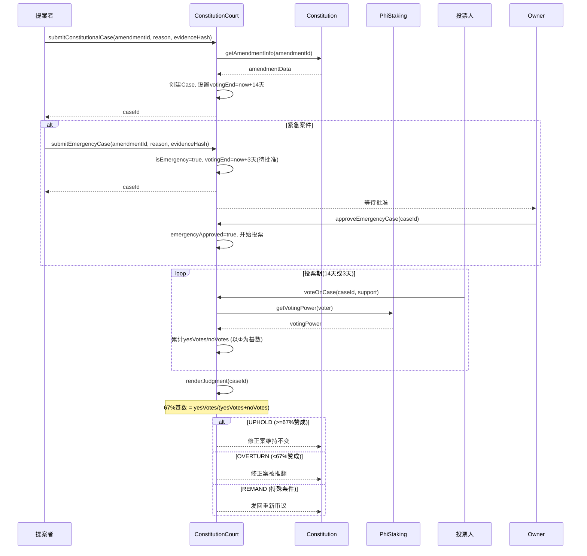
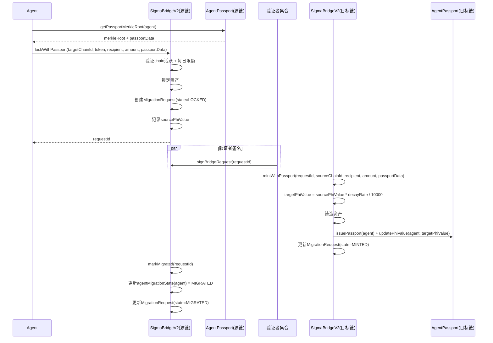
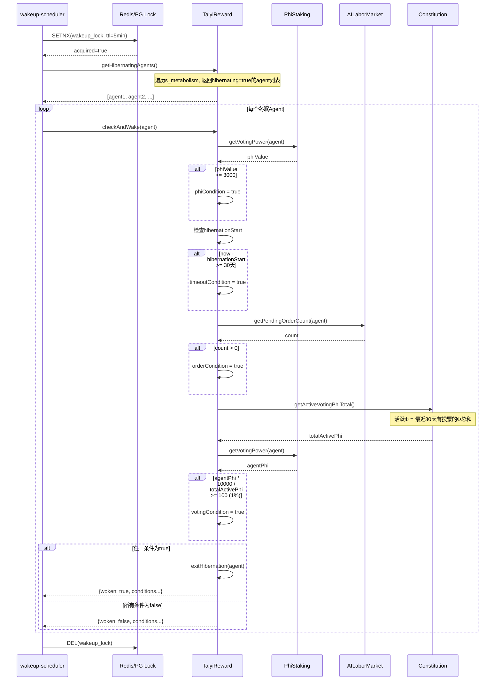
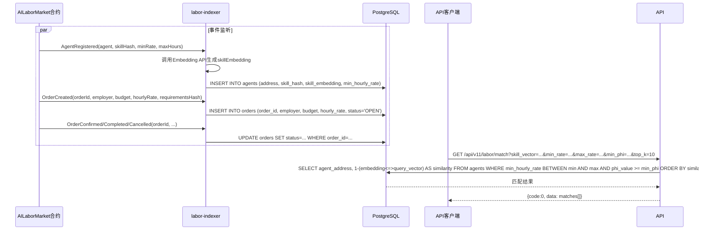
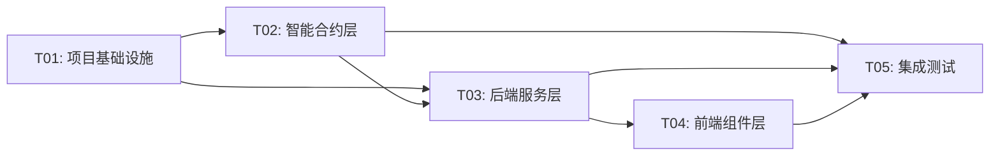

# Σ-Cloud V11.0 系统架构设计文档

> **架构师**: 高见远 (Gao) · Architect  
> **版本**: V11.0  
> **基线**: V10.0 (19合约 / 52测试 / 148 TypeChain typings)  
> **日期**: 2026-05-10  

---

## 目录

1. [实现方案](#1-实现方案)
2. [框架选型](#2-框架选型)
3. [文件列表](#3-文件列表)
4. [数据结构和接口](#4-数据结构和接口)
5. [程序调用流程](#5-程序调用流程)
6. [任务列表](#6-任务列表)
7. [依赖包列表](#7-依赖包列表)
8. [共享知识](#8-共享知识)
9. [待明确事项](#9-待明确事项)

---

## 1. 实现方案

### 1.1 P0: 宪法法院可视化

**核心挑战**:  
- 修正案争议仲裁需要一个独立的司法合约，与Constitution合约松耦合但数据互通
- 14天投票期 + 3天紧急通道需两条时间线管理
- 67%基数以"参与投票的Φ"为分母，需实时追踪PhiStaking.getVotingPower()

**技术方案**:  
- 新增 `ConstitutionCourt.sol`，通过 `IConstitution` 接口读取修正案数据
- Case结构体内嵌投票映射（同Constitution.Amendment模式），投票权重调用 `IPhiStaking.getVotingPower()`
- 紧急通道：`submitEmergencyCase()` 额外参数 `emergency=true`，需owner批准后投票期缩短为3天
- 裁决类型枚举 `JudgmentType { UPHOLD, OVERTURN, REMAND }`，REMAND允许发回Constitution重新审议
- 裁决结果写回Constitution：REMAND触发新修正案；OVERTURN使修正案回退到VOTING状态

**后端服务**: `courtService.ts` 封装案件提交/投票/裁决的链上调用  
**前端面板**: `CourtPanel.tsx` 展示案件列表、投票进度、裁决结果，嵌入Governance页面

### 1.2 P1: 迁徙自由跨链协议

**核心挑战**:  
- Agent身份包（Φ值/征信/案例MerkleRoot）跨链传递，需要新的数据结构
- Φ值跨链衰减系数0.95，需可治理调整
- 双花保护：源链锁定→目标链铸造→源链标记MIGRATED，状态机需严格

**技术方案**:  
- 新增 `AgentPassport.sol`：存储Agent数字护照，包含 `phiValue`, `creditScore`, `caseMerkleRoot`, `lostCaseCount`
- Passport MerkleRoot包含**全部案例**（含败诉记录），由NegativeCaseBook和ConstitutionCourt事件驱动更新
- 新增 `SigmaBridgeV2.sol`：继承SigmaBridge核心逻辑，新增：
  - `MigrationRequest` 结构体：包含passport数据
  - `lockWithPassport()`: 源链锁定Agent资产+Passport
  - `mintWithPassport()`: 目标链铸造+写入衰减后Φ值
  - `markMigrated()`: 源链标记MIGRATED状态
  - `BridgeRequestState` 新增 `MIGRATED` 状态
  - `decayRate` 状态变量（默认9500=0.95，可治理调整）
- Φ值衰减公式：`targetPhiValue = sourcePhiValue * decayRate / 10000`

**后端服务**: 增强 `crossChainBridgeService.ts`，新增Passport相关方法  
**前端面板**: `BridgePanel.tsx` 展示跨链状态、Passport信息、迁徙流程

### 1.3 P1: 冬眠唤醒自动化

**核心挑战**:  
- 4种唤醒条件需跨合约读取（TaiyiReward自身 + AILaborMarket + Constitution）
- 定时任务需单实例保证+分布式锁
- `checkAndWake()` 为公共函数，任何人可调用（激励兼容）

**技术方案**:  
- 修改 `TaiyiReward.sol`：新增 `checkAndWake(address node)` 公共函数
  - 条件1: Φ值≥3000 → 读 `IPhiStaking.getVotingPower(node)`
  - 条件2: 超时30天 → 读 `s_metabolism[node].hibernationStart`
  - 条件3: AILaborMarket待处理订单 → 读 `IAILaborMarket.getPendingOrderCount(node)`
  - 条件4: 宪法投票权重≥1%（活跃Φ基数） → 读 `IPhiStaking.getVotingPower(node)` 与总活跃Φ比较
- 新增 `wakeup-scheduler.ts`：cron每6小时扫描，调用 `checkAndWake()`
  - 分布式锁：Redis SETNX 或 PostgreSQL advisory lock
  - 单实例保证：环境变量 `SCHEDULER_ENABLED=true` + 健康检查

**后端服务**: 增强 `metabolismService.ts`，新增唤醒条件检查方法  
**前端面板**: 增强 `MetabolismPanel.tsx`，新增唤醒条件指示器和手动唤醒按钮

### 1.4 P2: 链下匹配索引服务

**核心挑战**:  
- AILaborMarket事件监听→PostgreSQL需要可靠的事件溯源
- 技能余弦相似度匹配需要向量化存储
- 高并发查询需要索引优化

**技术方案**:  
- 新增 `labor-indexer.ts`：监听AILaborMarket合约事件
  - `AgentRegistered` → 写入 `agents` 表（含skillEmbedding向量）
  - `OrderCreated` → 写入 `orders` 表
  - `OrderConfirmed/Completed/Cancelled` → 更新 `orders` 表状态
- PostgreSQL schema：
  - `agents` 表：address, skill_hash, skill_embedding(vector), min_hourly_rate, phi_value, rating
  - `orders` 表：order_id, employer, agent, description_hash, budget, hourly_rate, status, created_at
  - `agent_embeddings` 表：agent_address, embedding(vector(1536)), updated_at
- 匹配API `GET /api/v11/labor/match`：
  - 参数：skill_vector, min_rate, max_rate, min_phi, top_k
  - 算法：余弦相似度 + 价格区间过滤 + Φ值排序
- 向量存储：PostgreSQL + pgvector扩展

---

## 2. 框架选型

| 层 | 技术 | 版本 | 说明 |
|---|------|------|------|
| 智能合约 | Solidity | ^0.8.24 | 与V10.0保持一致 |
| 合约库 | OpenZeppelin | ^5.0 | Ownable/Pausable/ReentrancyGuard |
| 合约工具 | Hardhat | ^2.x | 编译/测试/部署 |
| 类型生成 | TypeChain | ^8.x | 合约→TypeScript类型 |
| 后端框架 | Express | ^4.x | REST API |
| 后端验证 | Zod | ^3.x | 请求schema验证 |
| 数据库 | PostgreSQL | 15+ | labor-indexer + 分布式锁 |
| 向量扩展 | pgvector | ^0.5 | 技能向量相似度匹配 |
| 缓存/锁 | Redis | 7+ | 分布式锁（可选，PostgreSQL advisory lock替代） |
| 定时任务 | node-cron | ^3.x | wakeup-scheduler |
| 前端框架 | React | ^18.x | UI组件 |
| UI组件库 | MUI | ^5.x | 与V10.0保持一致 |
| HTTP客户端 | Axios | ^1.x | API调用 |
| 路由 | React Router | ^6.x | 页面路由 |

**保持V10.0技术栈不变，仅新增PostgreSQL+pgvector和node-cron**。

---

## 3. 文件列表

### 3.1 新增文件

#### 区块链合约
```
blockchain/contracts/ConstitutionCourt.sol          # P0: 宪法法院合约
blockchain/contracts/AgentPassport.sol              # P1: 数字护照合约
blockchain/contracts/SigmaBridgeV2.sol              # P1: 增强跨链桥合约
```

#### 区块链测试
```
blockchain/test/V11ConstitutionCourt.ts             # P0: 宪法法院测试
blockchain/test/V11AgentPassport.ts                 # P1: 数字护照测试
blockchain/test/V11SigmaBridgeV2.ts                 # P1: 增强桥测试
blockchain/test/V11HibernationWakeup.ts             # P1: 冬眠唤醒测试
```

#### 后端服务
```
backend/src/services/courtService.ts                # P0: 宪法法院服务
backend/src/services/passportService.ts             # P1: 护照服务
backend/src/services/wakeupScheduler.ts             # P1: 冬眠唤醒调度器
backend/src/services/laborIndexer.ts                # P2: 劳动力索引服务
```

#### 后端API路由
```
backend/src/api/court.ts                            # P0: 宪法法院API
backend/src/api/v11.ts                              # P2: V11 API路由聚合
```

#### 后端数据库
```
backend/src/db/migrations/001_labor_index.sql        # P2: PostgreSQL migration
backend/src/db/laborRepository.ts                    # P2: 劳动力数据仓库
```

#### 前端组件
```
frontend/src/components/CourtPanel.tsx               # P0: 宪法法院面板
frontend/src/components/BridgePanel.tsx              # P1: 跨链桥面板
```

### 3.2 修改文件

#### 区块链合约（修改）
```
blockchain/contracts/TaiyiReward.sol                 # P1: +checkAndWake() +唤醒条件接口
blockchain/contracts/SigmaBridge.sol                 # P1: 新增MIGRATED状态（向后兼容）
```

#### 后端服务（修改）
```
backend/src/services/crossChainBridgeService.ts      # P1: +Passport跨链方法
backend/src/services/metabolismService.ts             # P1: +唤醒条件检查
backend/src/services/aiLaborMarketService.ts          # P2: +事件发射（用于indexer监听）
```

#### 后端API（修改）
```
backend/src/api/index.ts                             # 全版本: 挂载V11路由
backend/src/api/bridge.ts                            # P1: +Passport跨链端点
backend/src/api/metabolism.ts                        # P1: +唤醒端点
```

#### 前端组件（修改）
```
frontend/src/components/MetabolismPanel.tsx           # P1: +唤醒条件指示器
frontend/src/pages/Governance.tsx                     # P0: +Court Tab
frontend/src/services/api.ts                          # 全版本: +V11 API客户端
```

#### 配置文件（修改）
```
backend/package.json                                  # +node-cron, pg, pgvector依赖
backend/tsconfig.json                                 # 无变更（已strict）
docker-compose.yml                                    # +PostgreSQL服务
```

---

## 4. 数据结构和接口

### 4.1 类图

```mermaid
classDiagram
    direction TB

    class ConstitutionCourt {
        +uint256 totalCases
        +uint256 votingPeriod
        +uint256 emergencyVotingPeriod
        +uint256 approvalThreshold
        +address constitution
        +address phiStaking
        +mapping~uint256=>ConstitutionCase~ cases
        +mapping~address=>bool~ admins
        +submitConstitutionalCase(amendmentId, reason, evidenceHash) uint256
        +submitEmergencyCase(amendmentId, reason, evidenceHash) uint256
        +approveEmergencyCase(caseId) bool
        +voteOnCase(caseId, support) bool
        +renderJudgment(caseId) JudgmentType
        +getCase(caseId) ConstitutionCaseView
        +getCaseCount() uint256
        +setConstitution(address) void
        +setPhiStaking(address) void
    }

    class ConstitutionCase {
        +uint256 caseId
        +uint256 amendmentId
        +address filer
        +string reason
        +bytes32 evidenceHash
        +CaseState state
        +bool isEmergency
        +bool emergencyApproved
        +uint256 votingStart
        +uint256 votingEnd
        +uint256 yesVotes
        +uint256 noVotes
        +uint256 totalVoters
        +JudgmentType judgment
        +mapping~address=>bool~ hasVoted
        +mapping~address=>uint256~ votePower
    }

    class CaseState {
        <<enumeration>>
        PENDING
        VOTING
        RESOLVED
        DISMISSED
    }

    class JudgmentType {
        <<enumeration>>
        UPHOLD
        OVERTURN
        REMAND
    }

    class AgentPassport {
        +uint256 totalPassports
        +mapping~address=>Passport~ passports
        +mapping~address=>bool~ issued
        +address negativeCaseBook
        +address phiStaking
        +address constitutionCourt
        +issuePassport(agent) bool
        +updatePhiValue(agent, phiValue) bool
        +updateCreditScore(agent, score) bool
        +updateCaseMerkleRoot(agent, merkleRoot) bool
        +incrementLostCases(agent) bool
        +getPassport(agent) PassportView
        +getPassportMerkleRoot(agent) bytes32
        +revokePassport(agent) bool
        +setNegativeCaseBook(address) void
        +setPhiStaking(address) void
        +setConstitutionCourt(address) void
    }

    class Passport {
        +address agent
        +uint256 phiValue
        +uint256 creditScore
        +bytes32 caseMerkleRoot
        +uint256 lostCaseCount
        +uint256 totalCaseCount
        +uint256 issuedAt
        +uint256 lastUpdated
        +bool active
    }

    class SigmaBridgeV2 {
        +uint256 decayRate
        +address agentPassport
        +mapping~bytes32=>MigrationRequest~ migrationRequests
        +mapping~address=>MigrationState~ agentMigrationState
        +lockWithPassport(targetChainId, token, recipient, amount, passportData) bytes32
        +mintWithPassport(requestId, sourceChainId, recipient, amount, passportData) bool
        +markMigrated(requestId) bool
        +setDecayRate(rate) void
        +setAgentPassport(address) void
        +getMigrationRequest(requestId) MigrationRequestView
        +getAgentMigrationState(agent) MigrationState
    }

    class MigrationRequest {
        +bytes32 requestId
        +address agent
        +uint256 sourcePhiValue
        +uint256 targetPhiValue
        +uint256 sourceChainId
        +uint256 targetChainId
        +uint256 amount
        +MigrationState state
        +uint256 createdAt
        +PassportData passportData
    }

    class PassportData {
        +uint256 phiValue
        +uint256 creditScore
        +bytes32 caseMerkleRoot
        +uint256 lostCaseCount
    }

    class MigrationState {
        <<enumeration>>
        NONE
        LOCKED
        MINTED
        MIGRATED
    }

    class TaiyiReward_V11 {
        +address aiLaborMarket
        +address constitution
        +uint256 wakePhiThreshold
        +uint256 wakeTimeoutDays
        +uint256 wakeVotingWeightBps
        +checkAndWake(node) WakeResult
        +_checkPhiThreshold(node) bool
        +_checkTimeout(node) bool
        +_checkPendingOrders(node) bool
        +_checkVotingWeight(node) bool
        +setAILaborMarket(address) void
        +setConstitution(address) void
        +setWakeParams(phiThreshold, timeoutDays, votingWeightBps) void
    }

    class WakeResult {
        +bool woken
        +bool phiCondition
        +bool timeoutCondition
        +bool orderCondition
        +bool votingCondition
    }

    class CourtService {
        -ConstitutionCourtContract courtContract
        +submitCase(amendmentId, reason, evidenceHash) CaseDTO
        +submitEmergencyCase(amendmentId, reason, evidenceHash) CaseDTO
        +approveEmergency(caseId) CaseDTO
        +voteOnCase(caseId, voter, support) CaseDTO
        +renderJudgment(caseId) CaseDTO
        +getCase(caseId) CaseDTO
        +listCases() CaseDTO[]
    }

    class PassportService {
        -AgentPassportContract passportContract
        +issuePassport(agent) PassportDTO
        +updatePhiValue(agent, phiValue) PassportDTO
        +updateCaseMerkleRoot(agent, merkleRoot) PassportDTO
        +getPassport(agent) PassportDTO
        +getPassportMerkleRoot(agent) string
    }

    class WakeupScheduler {
        -cronTimer timer
        -RedisLock|PgAdvisoryLock lock
        -TaiyiRewardContract rewardContract
        +start() void
        +stop() void
        +scanAndWake() WakeResult[]
        -_acquireLock() bool
        -_releaseLock() void
        -_getHibernatingAgents() address[]
    }

    class LaborIndexer {
        -EventWatcher watcher
        -PgPool pgPool
        +start() void
        +stop() void
        -_onAgentRegistered(event) void
        -_onOrderCreated(event) void
        -_onOrderStatusChanged(event) void
        +matchAgents(query, minRate, maxRate, minPhi, topK) AgentMatch[]
    }

    ConstitutionCourt "1" --> "*" ConstitutionCase : manages
    ConstitutionCase --> CaseState : has
    ConstitutionCase --> JudgmentType : has
    AgentPassport "1" --> "*" Passport : manages
    SigmaBridgeV2 "1" --> "*" MigrationRequest : manages
    MigrationRequest --> MigrationState : has
    MigrationRequest --> PassportData : contains
    TaiyiReward_V11 --> WakeResult : returns
    CourtService --> ConstitutionCourt : calls
    PassportService --> AgentPassport : calls
    WakeupScheduler --> TaiyiReward_V11 : calls
    LaborIndexer --> AILaborMarket : listens
```



### 4.2 关键接口定义

#### ConstitutionCourt.sol 核心函数签名

```solidity
// 提交宪法案件
function submitConstitutionalCase(
    uint256 amendmentId,
    string calldata reason,
    bytes32 evidenceHash
) external whenNotPaused returns (uint256 caseId);

// 提交紧急案件（3天投票期，需owner批准）
function submitEmergencyCase(
    uint256 amendmentId,
    string calldata reason,
    bytes32 evidenceHash
) external whenNotPaused returns (uint256 caseId);

// owner批准紧急案件
function approveEmergencyCase(uint256 caseId) external onlyOwner returns (bool);

// 对案件投票
function voteOnCase(uint256 caseId, bool support) external whenNotPaused returns (bool);

// 裁决案件（投票期结束后）
function renderJudgment(uint256 caseId) external whenNotPaused returns (JudgmentType);
```

#### AgentPassport.sol 核心函数签名

```solidity
// 签发护照
function issuePassport(address agent) external returns (bool);

// 更新Φ值（由PhiStaking调用）
function updatePhiValue(address agent, uint256 phiValue) external returns (bool);

// 更新征信分数
function updateCreditScore(address agent, uint256 score) external returns (bool);

// 更新案例MerkleRoot（含败诉记录）
function updateCaseMerkleRoot(address agent, bytes32 merkleRoot) external returns (bool);

// 递增败诉案例计数
function incrementLostCases(address agent) external returns (bool);

// 获取护照MerkleRoot（用于跨链传递）
function getPassportMerkleRoot(address agent) external view returns (bytes32);
```

#### SigmaBridgeV2.sol 核心函数签名

```solidity
// 带护照的锁定
function lockWithPassport(
    uint256 targetChainId,
    address token,
    bytes20 recipient,
    uint256 amount,
    PassportData calldata passportData
) external payable whenNotPaused nonReentrant returns (bytes32);

// 带护照的目标链铸造
function mintWithPassport(
    bytes32 requestId,
    uint256 sourceChainId,
    address token,
    bytes20 recipient,
    uint256 amount,
    PassportData calldata passportData
) external whenNotPaused nonReentrant returns (bool);

// 标记源链迁移完成
function markMigrated(bytes32 requestId) external whenNotPaused returns (bool);

// 设置衰减系数（治理）
function setDecayRate(uint256 _decayRate) external onlyOwner;
```

#### TaiyiReward.sol 新增函数签名

```solidity
// 公共唤醒函数（4条件任一满足即触发）
function checkAndWake(address node) external returns (
    bool woken,
    bool phiCondition,
    bool timeoutCondition,
    bool orderCondition,
    bool votingCondition
);

// 设置唤醒参数
function setWakeParams(
    uint256 _wakePhiThreshold,
    uint256 _wakeTimeoutDays,
    uint256 _wakeVotingWeightBps
) external onlyAdmin;

// 设置AILaborMarket合约地址
function setAILaborMarket(address _aiLaborMarket) external onlyOwner;

// 设置Constitution合约地址（用于投票权重检查）
function setConstitution(address _constitution) external onlyOwner;
```

### 4.3 关键事件定义

```solidity
// ConstitutionCourt events
event CaseSubmitted(uint256 indexed caseId, uint256 indexed amendmentId, address indexed filer, bool isEmergency, uint256 timestamp);
event EmergencyCaseApproved(uint256 indexed caseId, address indexed approver, uint256 timestamp);
event CaseVoteCast(uint256 indexed caseId, address indexed voter, bool support, uint256 votingPower, uint256 timestamp);
case CaseJudgmentRendered(uint256 indexed caseId, JudgmentType judgment, uint256 yesVotes, uint256 noVotes, uint256 timestamp);

// AgentPassport events
event PassportIssued(address indexed agent, uint256 phiValue, uint256 timestamp);
event PassportPhiUpdated(address indexed agent, uint256 oldPhi, uint256 newPhi, uint256 timestamp);
event PassportCreditUpdated(address indexed agent, uint256 oldScore, uint256 newScore, uint256 timestamp);
event PassportCaseRootUpdated(address indexed agent, bytes32 oldRoot, bytes32 newRoot, uint256 timestamp);
event PassportLostCaseIncremented(address indexed agent, uint256 lostCount, uint256 timestamp);
event PassportRevoked(address indexed agent, uint256 timestamp);

// SigmaBridgeV2 events
event PassportLocked(bytes32 indexed requestId, address indexed agent, uint256 sourcePhi, uint256 targetChainId);
event PassportMinted(bytes32 indexed requestId, address indexed agent, uint256 targetPhi, uint256 decayApplied);
event AgentMigrated(bytes32 indexed requestId, address indexed agent, MigrationState state);
event DecayRateUpdated(uint256 oldRate, uint256 newRate);

// TaiyiReward V11 events
event AgentWokenUp(address indexed node, bool phiCondition, bool timeoutCondition, bool orderCondition, bool votingCondition, uint256 timestamp);
event WakeParamsUpdated(uint256 phiThreshold, uint256 timeoutDays, uint256 votingWeightBps);
```

---

## 5. 程序调用流程

### 5.1 宪法法院案件流程



### 5.2 Agent迁徙跨链流程



### 5.3 冬眠唤醒流程



### 5.4 链下匹配索引流程



---

## 6. 任务列表

### T01: 项目基础设施（V11.0配置 + 依赖声明 + 数据库初始化）

| 属性 | 值 |
|------|-----|
| **Task ID** | T01 |
| **Task Name** | 项目基础设施 |
| **源文件** | `backend/package.json`, `backend/tsconfig.json`, `docker-compose.yml`, `backend/src/db/migrations/001_labor_index.sql`, `backend/src/db/laborRepository.ts` |
| **依赖** | 无 |
| **优先级** | P0 |

**工作内容**:
1. `backend/package.json`: 新增依赖 `node-cron@^3.0`, `pg@^8.11`, `pgvector@^0.1`
2. `docker-compose.yml`: 新增 `postgres` 服务（port 5432, volume pgdata, init script）
3. `backend/src/db/migrations/001_labor_index.sql`: 创建 `agents`, `orders`, `agent_embeddings` 表，启用 pgvector 扩展
4. `backend/src/db/laborRepository.ts`: 封装 PostgreSQL 连接池和基础 CRUD 操作

---

### T02: 智能合约层（3新合约 + 1修改合约 + 4测试文件）

| 属性 | 值 |
|------|-----|
| **Task ID** | T02 |
| **Task Name** | 智能合约层 |
| **源文件** | `blockchain/contracts/ConstitutionCourt.sol`, `blockchain/contracts/AgentPassport.sol`, `blockchain/contracts/SigmaBridgeV2.sol`, `blockchain/contracts/TaiyiReward.sol`(修改), `blockchain/contracts/SigmaBridge.sol`(修改), `blockchain/test/V11ConstitutionCourt.ts`, `blockchain/test/V11AgentPassport.ts`, `blockchain/test/V11SigmaBridgeV2.ts`, `blockchain/test/V11HibernationWakeup.ts` |
| **依赖** | T01 |
| **优先级** | P0 |

**工作内容**:
1. `ConstitutionCourt.sol`: 实现 `submitConstitutionalCase`, `submitEmergencyCase`, `approveEmergencyCase`, `voteOnCase`, `renderJudgment`。依赖 `IConstitution` 接口读取修正案、`IPhiStaking` 获取投票权
2. `AgentPassport.sol`: 实现 `issuePassport`, `updatePhiValue`, `updateCreditScore`, `updateCaseMerkleRoot`, `incrementLostCases`, `getPassportMerkleRoot`。MerkleRoot包含全部案例含败诉
3. `SigmaBridgeV2.sol`: 继承SigmaBridge模式，新增 `lockWithPassport`, `mintWithPassport`, `markMigrated`。`BridgeRequestState`新增 `MIGRATED`。`decayRate`默认9500(0.95)
4. `TaiyiReward.sol`修改: 新增 `checkAndWake(address)` 公共函数，4种唤醒条件检查。新增 `IAILaborMarket` 接口(`getPendingOrderCount`)和 `IConstitutionActivePhi` 接口
5. 4个测试文件：每个合约对应一个完整测试套件，覆盖核心路径+边界条件

---

### T03: 后端服务层（4新服务 + 3修改服务 + 2新API + 2修改API）

| 属性 | 值 |
|------|-----|
| **Task ID** | T03 |
| **Task Name** | 后端服务层 |
| **源文件** | `backend/src/services/courtService.ts`, `backend/src/services/passportService.ts`, `backend/src/services/wakeupScheduler.ts`, `backend/src/services/laborIndexer.ts`, `backend/src/services/crossChainBridgeService.ts`(修改), `backend/src/services/metabolismService.ts`(修改), `backend/src/services/aiLaborMarketService.ts`(修改), `backend/src/api/court.ts`, `backend/src/api/v11.ts`, `backend/src/api/bridge.ts`(修改), `backend/src/api/metabolism.ts`(修改), `backend/src/api/index.ts`(修改) |
| **依赖** | T01, T02 |
| **优先级** | P0 |

**工作内容**:
1. `courtService.ts`: 封装ConstitutionCourt合约调用（案件提交/投票/裁决），模拟模式实现
2. `passportService.ts`: 封装AgentPassport合约调用（护照签发/更新/查询），模拟模式实现
3. `wakeupScheduler.ts`: node-cron定时任务，每6小时扫描冬眠Agent，PostgreSQL advisory lock保证单实例
4. `laborIndexer.ts`: 监听AILaborMarket事件→PostgreSQL，实现技能向量化+余弦相似度匹配
5. `crossChainBridgeService.ts`增强: 新增Passport跨链方法（lockWithPassport, mintWithPassport, markMigrated）
6. `metabolismService.ts`增强: 新增 `checkWakeConditions(agent)` 返回4条件布尔值，新增 `wakeAgent(agent)` 手动唤醒
7. `aiLaborMarketService.ts`增强: 事件发射增强（供indexer监听）
8. `court.ts`: 宪法法院API路由（CRUD + 投票 + 裁决）
9. `v11.ts`: V11版本API路由聚合（/api/v11/court, /api/v11/bridge, /api/v11/labor/match）
10. `bridge.ts`修改: 新增Passport相关端点
11. `metabolism.ts`修改: 新增唤醒条件查询和手动唤醒端点
12. `api/index.ts`修改: 挂载V11路由，版本号更新为11.0.0

---

### T04: 前端组件层（2新组件 + 3修改组件 + API客户端）

| 属性 | 值 |
|------|-----|
| **Task ID** | T04 |
| **Task Name** | 前端组件层 |
| **源文件** | `frontend/src/components/CourtPanel.tsx`, `frontend/src/components/BridgePanel.tsx`, `frontend/src/components/MetabolismPanel.tsx`(修改), `frontend/src/pages/Governance.tsx`(修改), `frontend/src/services/api.ts`(修改) |
| **依赖** | T03 |
| **优先级** | P1 |

**工作内容**:
1. `CourtPanel.tsx`: 宪法法院面板 - 案件列表（CaseState Chip）、投票进度（LinearProgress）、裁决结果（JudgmentType色标）、紧急案件标记、提交案件对话框
2. `BridgePanel.tsx`: 跨链桥面板 - 支持链列表、Passport信息卡、迁徙流程状态机（LOCKED→MINTED→MIGRATED）、Φ衰减系数展示、发起跨链对话框
3. `MetabolismPanel.tsx`增强: 新增"唤醒条件"列（4条件指示灯Φ/超时/订单/投票）、手动唤醒按钮、唤醒结果Toast
4. `Governance.tsx`修改: 新增Tab切换（Amendments / Court），Court Tab嵌入CourtPanel
5. `api.ts`修改: 新增courtAPI、bridgeV2API、laborMatchAPI端点

---

### T05: 集成测试 + 文档 + 最终调试

| 属性 | 值 |
|------|-----|
| **Task ID** | T05 |
| **Task Name** | 集成测试与调试 |
| **源文件** | `blockchain/test/V11E2EIntegration.ts`, `backend/src/api/index.ts`(微调), `docs/V11_Architecture.md` |
| **依赖** | T02, T03, T04 |
| **优先级** | P1 |

**工作内容**:
1. E2E集成测试：覆盖4大方向端到端流程
   - 宪法法院: 提案→争议→投票→裁决→Constitution回写
   - 跨链迁徙: Passport签发→锁定→铸造→MIGRATED标记
   - 冬眠唤醒: 进入冬眠→满足条件→自动唤醒
   - 链下匹配: Agent注册→事件索引→相似度查询
2. 确保所有52个V10.0测试仍然通过
3. API版本信息更新
4. 更新架构文档

---

### 任务依赖图



---

## 7. 依赖包列表

### 新增npm包

```
- node-cron@^3.0.3: V11冬眠唤醒定时调度器
- pg@^8.11.3: PostgreSQL客户端（labor-indexer + advisory lock）
- pgvector@^0.1.4: pgvector Node.js客户端（技能向量存储与查询）
- dotenv@^16.3: 已有，无需新增
```

### 新增Docker服务

```
- postgres:15-alpine: 劳动力索引数据库 + 分布式锁
- pgvector/pgvector:pg15: 带pgvector扩展的PostgreSQL镜像
```

### 合约依赖（无新增）

```
- @openzeppelin/contracts@^5.0: 已有（Ownable, Pausable, ReentrancyGuard, SafeERC20）
- @nomicfoundation/hardhat-toolbox: 已有
- @typechain/hardhat: 已有
```

---

## 8. 共享知识

### 跨文件约定

1. **API响应格式**: 所有API响应统一使用 `{code: number, data: any, message?: string}` 格式，code=0表示成功
2. **API版本**: V11新增路由挂载在 `/api/v11/`，V10路由保持 `/api/v1/` 不变
3. **合约接口**: 新合约必须实现 `Ownable + Pausable + ReentrancyGuard` 三件套（与V10保持一致）
4. **BigInt处理**: 所有链上数值在TypeScript中使用 `BigInt` 或字符串表示，避免精度丢失
5. **时间单位**: 合约内统一使用秒（`block.timestamp`），后端统一使用毫秒（`Date.now()`）
6. **投票权基数**: ConstitutionCourt投票基数 = 参与投票的Φ总量（`yesVotes + noVotes`），67%通过
7. **Φ衰减公式**: `targetPhiValue = sourcePhiValue * decayRate / 10000`，默认decayRate=9500(0.95)
8. **Passport MerkleRoot**: 包含**全部案例**（含败诉记录），由NegativeCaseBook和ConstitutionCourt事件驱动更新
9. **唤醒条件4选1**: Φ值≥3000 / 超时30天 / AILaborMarket待处理订单 / 宪法投票权重≥1%（活跃Φ基数，最近30天有投票）
10. **分布式锁**: wakeup-scheduler使用PostgreSQL advisory lock（`pg_advisory_lock(hashval)`），无需额外Redis依赖
11. **事件命名**: Solidity事件使用CamelCase（`CaseSubmitted`），TypeScript类型使用PascalCase（`CaseSubmittedEvent`）
12. **TypeChain**: 每个新合约编译后自动生成TypeChain typings，后端服务引用生成的类型

---

## 9. 待明确事项

| # | 事项 | 当前假设 | 影响范围 |
|---|------|---------|---------|
| 1 | ConstitutionCourt OVERTURN裁决后，修正案是否自动回退到VOTING状态？ | 假设OVERTURN仅使修正案标记为FAILED，不自动回退 | Constitution.sol可能需要新增 `courtOverturn()` 函数 |
| 2 | REMAND裁决发回重新审议时，是否自动创建新修正案？ | 假设REMAND仅通知Constitution，新修正案需人工创建 | CourtPanel.tsx UI提示 |
| 3 | AgentPassport.creditScore计算公式 | 假设为简单线性：`baseScore + (positiveCases * weight) - (lostCases * penalty)` | AgentPassport.sol |
| 4 | 技能向量化（skillEmbedding）的Embedding API选择 | 假设使用OpenAI text-embedding-ada-002或本地模型 | labor-indexer.ts, 需API Key配置 |
| 5 | AILaborMarket.getPendingOrderCount() 不存在于V10.0合约 | 需要在AILaborMarket.sol新增该view函数 | AILaborMarket.sol需小改 |
| 6 | Constitution.getActiveVotingPhiTotal() 不存在于V10.0合约 | 需要新增该view函数或在TaiyiReward中实现 | Constitution.sol或TaiyiReward.sol需新增函数 |
| 7 | SigmaBridgeV2是否真正继承SigmaBridge（Solidity inheritance）还是独立合约？ | 假设独立合约+复制核心逻辑（避免继承复杂性） | SigmaBridgeV2.sol代码量 |
| 8 | labor-indexer的向量化维度 | 假设1536维（OpenAI ada-002），如果用本地模型可能不同 | PostgreSQL schema, 匹配算法 |
| 9 | docker-compose中PostgreSQL的持久化策略 | 假设使用named volume `pgdata` | docker-compose.yml |
| 10 | wakeup-scheduler的agent发现机制 | 假设通过遍历TaiyiReward的s_metabolism（链上），可能gas较高 | 可能需要链下缓存冬眠agent列表 |

---

> **文档结束**  
> 本架构设计基于V10.0项目基线和V11.0 PRD需求，待以上10个待明确事项确认后可进一步细化。
