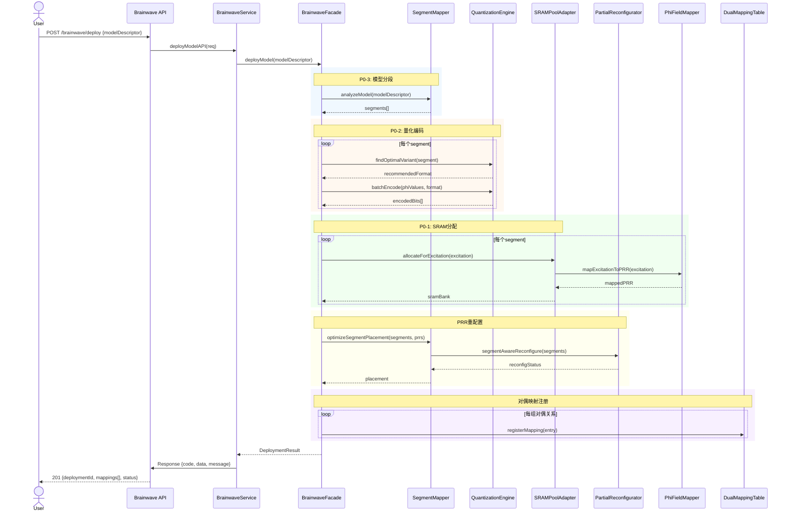
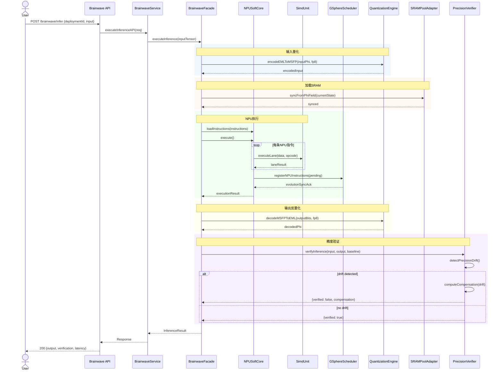
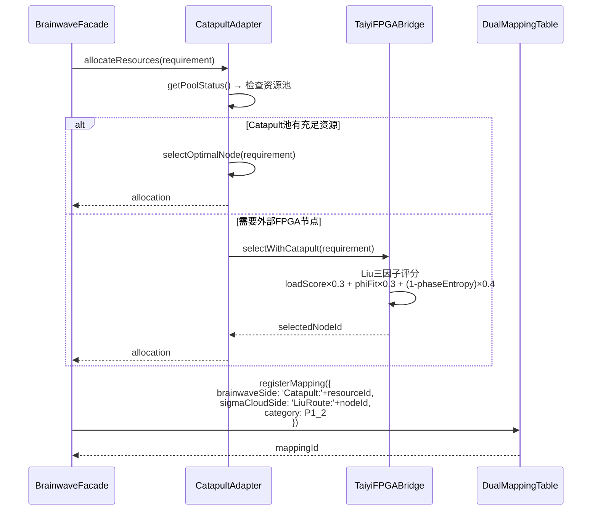
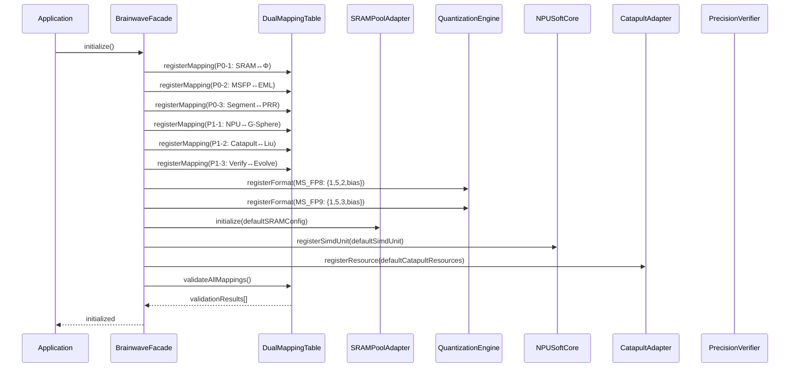
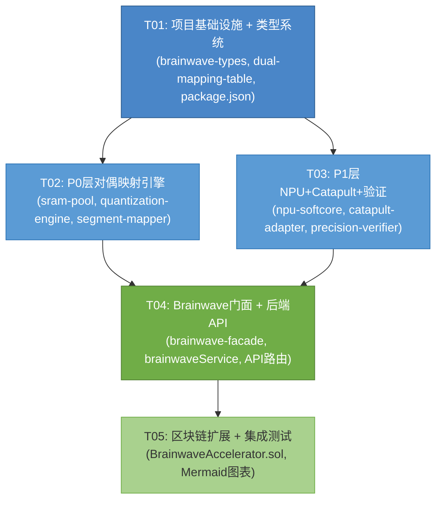

# 西格玛云 V5.0 Brainwave 整合架构设计

> **版本**: V5.0  
> **架构师**: 高见远 (Gao)  
> **日期**: 2026-05-22  
> **基线**: V4.0 (SubDAO + Bridge + Oracle) → V5.0 (Brainwave 五层对偶映射)

---

## Part A: 系统设计

### 1. 实现方案 + 框架选型

#### 1.1 核心技术挑战

| 挑战 | 说明 | 对应需求 |
|------|------|----------|
| **片上SRAM池化 ↔ Φ场全息存储对偶** | Brainwave 的 DPU 板载 64MB SRAM 需要与 Φ 场的分布式全息存储模型建立双向映射，保证数据一致性 | P0-1 |
| **ms-fp8/9 低精度浮点 ↔ EML一元数Φ值转换** | 微软 ms-fp8 (1-5-2) / ms-fp9 (1-5-3) 格式与 EML 复数 Φ=|Φ|·e^{iθ} 的互转，需要无精度损失的双向量化管线 | P0-2 |
| **模型分段映射 ↔ Φ激发→PRR映射** | Brainwave 将 DNN 模型切分为 segments 映射到 MVU 阵列，需要与现有 Φ 激发→PRR 映射逻辑对齐 | P0-3 |
| **NPU软核+超级SIMD ↔ G-Sphere调度** | Brainwave 的 NPU 指令集需嵌入 G-Sphere 的离散 Euler-Lagrange 演化循环 | P1-1 |
| **Catapult资源池 ↔ 刘路由+FPGA集群** | Catapult v2 的硬件资源调度需与现有 Liu routing 三因子评分融合 | P1-2 |
| **精度验证+重训练补偿管线** | 低精度推理的精度漂移检测与补偿，需与演化硬件的自适应机制结合 | P1-3 |

#### 1.2 架构模式

采用 **分层适配器模式 (Layered Adapter Pattern)**：

```
┌──────────────────────────────────────────────┐
│           V5.0 API Layer (Express)           │
├──────────────────────────────────────────────┤
│        Brainwave Service Facade              │
├───────┬──────────┬──────────┬────────────────┤
│ P0-1  │  P0-2    │  P0-3    │   P1 Layer     │
│SRAM   │Quantize  │Segment   │ NPU+Catapult   │
│Pool   │Engine    │Mapper    │ +Verification  │
├───────┴──────────┴──────────┴────────────────┤
│     Existing Φ Field + FPGA Core (V4.0)      │
│  PhiFieldMapper | PartialReconfigurator      │
│  GSphereScheduler | TaiyiFPGABridge          │
│  EvolvableHardware | PhiCalculator           │
├──────────────────────────────────────────────┤
│     Blockchain Layer (Solidity + ethers.js)   │
└──────────────────────────────────────────────┘
```

**关键设计决策**：
- **适配器而非重写**：所有 Brainwave 功能通过 Adapter 类接入，不修改现有核心类的公共 API
- **对偶映射表驱动**：P0 层的五组对偶映射通过配置表 (DualMappingTable) 声明式定义，运行时查表
- **量化管线可插拔**：ms-fp8/9 ↔ EML Φ 值转换封装为独立 QuantizationEngine，支持未来扩展其他精度格式
- **NPU指令仿真**：NPU 软核指令集作为 GSphereScheduler 的扩展指令注册，不改变原有演化循环

#### 1.3 框架与库选型

| 类别 | 选型 | 版本 | 理由 |
|------|------|------|------|
| **运行时** | Node.js + TypeScript | ^20.x / ^5.4 | 与现有 V4.0 栈一致 |
| **Web框架** | Express | ^4.18 | 已有，无需更换 |
| **ORM** | Prisma | ^5.x | 已有，扩展 schema |
| **任务队列** | BullMQ | ^4.x | 已有，用于 Brainwave 异步编译/验证任务 |
| **实时通信** | Socket.IO | ^4.x | 已有，扩展 Brainwave 状态推送事件 |
| **图计算** | graphology | ^0.25 | 新增，用于 SRAM 池拓扑图 + 资源依赖图 |
| **定点数学** | decimal.js | ^10.4 | 新增，ms-fp8/9 位级精确运算 |
| **二进制编解码** | structron | ^2.0 | 新增，ms-fp8/9 二进制格式 pack/unpack |
| **矩阵运算** | ml-matrix | ^6.10 | 新增，NPU 超级SIMD矩阵运算仿真 |
| **验证框架** | zod | ^3.x | 已有，扩展 Brainwave 相关 schema |
| **智能合约** | Solidity + ethers.js | ^0.8.x / ^6.x | 已有，扩展 NPU 加速验证桥 |
| **测试** | Vitest | ^1.x | 新增（替代 jest），与 Vite 生态统一 |

---

### 2. 文件列表

#### 2.1 新增文件

```
# ── FPGA Emulator 层 (fpga-emulator/src/) ──

fpga-emulator/src/brainwave-types.ts                 # Brainwave 核心类型定义
fpga-emulator/src/sram-pool.ts                       # P0-1: 片上SRAM池化适配器
fpga-emulator/src/quantization-engine.ts              # P0-2: ms-fp8/9 ↔ EML Φ 量化引擎
fpga-emulator/src/segment-mapper.ts                  # P0-3: 模型分段映射适配器
fpga-emulator/src/npu-softcore.ts                    # P1-1: NPU软核指令仿真器
fpga-emulator/src/catapult-adapter.ts                # P1-2: Catapult资源池适配器
fpga-emulator/src/precision-verifier.ts              # P1-3: 精度验证+重训练补偿管线
fpga-emulator/src/dual-mapping-table.ts              # 五层对偶映射配置表
fpga-emulator/src/brainwave-facade.ts                # Brainwave统一门面

# ── Backend 服务层 (backend/src/) ──

backend/src/services/brainwaveService.ts             # Brainwave业务逻辑服务
backend/src/services/sramHolographicSync.ts          # SRAM↔全息存储同步服务
backend/src/services/quantizationPipeline.ts         # 量化管线后端编排
backend/src/services/npuTaskScheduler.ts             # NPU任务调度服务

# ── Backend API层 (backend/src/api/) ──

backend/src/api/brainwave.ts                         # Brainwave REST API路由

# ── 区块链层 (blockchain/contracts/) ──

blockchain/contracts/BrainwaveAccelerator.sol        # P2-3: NPU加速跨链验证桥合约

# ── 测试文件 ──

fpga-emulator/tests/quantization-engine.test.ts      # 量化引擎单元测试
fpga-emulator/tests/npu-softcore.test.ts             # NPU软核单元测试
fpga-emulator/tests/segment-mapper.test.ts           # 分段映射单元测试
fpga-emulator/tests/dual-mapping-table.test.ts       # 对偶映射表单元测试
backend/tests/brainwaveService.test.ts               # 后端Brainwave服务测试

# ── 文档 ──

docs/sequence-diagram.mermaid                        # 时序图
docs/class-diagram.mermaid                           # 类图
```

#### 2.2 修改文件

```
fpga-emulator/src/types.ts                           # 扩展 Brainwave 相关类型
fpga-emulator/src/index.ts                           # 导出 Brainwave 模块
fpga-emulator/src/fpga-emulator.ts                   # 集成 BrainwaveFacade
fpga-emulator/src/partial-reconfig.ts                # 扩展 PRR 映射支持分段
fpga-emulator/src/phi-field-mapper.ts                # 扩展 EML Φ 量化接口
fpga-emulator/src/gsphere-scheduler.ts               # 扩展 NPU 指令注册
fpga-emulator/src/taiyi_bridge.ts                    # 扩展 Catapult 节点选择
fpga-emulator/src/evolvable-hardware.ts              # 扩展重训练补偿适应度
fpga-emulator/package.json                           # 新增依赖

backend/src/api/index.ts                             # 注册 Brainwave 路由
backend/src/services/phiCalculator.ts                # 扩展量化集成
backend/src/services/dualTrackRouter.ts              # 扩展 Brainwave 语义路由
backend/package.json                                 # 新增依赖
backend/prisma/schema.prisma                         # 新增 Brainwave 模型

blockchain/contracts/PhiStaking.sol                  # 扩展 NPU 加速验证
```

---

### 3. 数据结构与接口

```mermaid
classDiagram
    direction TB

    %% ═══ P0-1: SRAM 池化 ↔ Φ 场全息存储 ═══
    class SRAMPoolConfig {
        +number totalSizeMB
        +number bankCount
        +number bankSizeKB
        +SRAMBank[] banks
    }

    class SRAMBank {
        +string bankId
        +number offset
        +number sizeKB
        +SRAMBankStatus status
        +string[] mappedPhiExcitationIds
    }

    class SRAMPoolAdapter {
        -SRAMPoolConfig config
        -PhiFieldMapper phiMapper
        -Map~string, SRAMBank~ allocationMap
        +initialize(config: SRAMPoolConfig): void
        +allocateForExcitation(excitation: PhiExcitation): SRAMBank
        +releaseBank(bankId: string): void
        +syncToPhiField(): PhiFieldState
        +syncFromPhiField(state: PhiFieldState): void
        +getHolographicReplica(bankId: string): Buffer
        +reportUtilization(): SRAMUtilizationReport
    }

    SRAMPoolAdapter --> SRAMPoolConfig : uses
    SRAMPoolAdapter --> PhiFieldMapper : delegates
    SRAMBank --> SRAMPoolConfig : contained

    %% ═══ P0-2: ms-fp8/9 量化引擎 ═══
    class MSFPFormat {
        +FPVariant variant
        +number signBits
        +number exponentBits
        +number mantissaBits
        +number bias
    }

    class EMLPhiValue {
        +number magnitude
        +number phaseAngle
        +toComplex(): {re: number, im: number}
        +fromComplex(re: number, im: number): EMLPhiValue
    }

    class QuantizationEngine {
        -Map~FPVariant, MSFPFormat~ formatRegistry
        -decimal.js.Decimal precision
        +registerFormat(format: MSFPFormat): void
        +encodeEMLToMSFP(phi: EMLPhiValue, variant: FPVariant): BigInt
        +decodeMSFPToEML(bits: BigInt, variant: FPVariant): EMLPhiValue
        +batchEncode(phis: EMLPhiValue[], variant: FPVariant): BigInt[]
        +batchDecode(bitsArray: BigInt[], variant: FPVariant): EMLPhiValue[]
        +quantizationError(phi: EMLPhiValue, variant: FPVariant): number
        +findOptimalVariant(phi: EMLPhiValue): FPVariant
    }

    QuantizationEngine --> MSFPFormat : manages
    QuantizationEngine --> EMLPhiValue : converts

    %% ═══ P0-3: 模型分段映射 ═══
    class ModelSegment {
        +string segmentId
        +number layerIndex
        +number paramCount
        +number computeCost
        +string targetPRRId
        +MSFPFormat quantFormat
    }

    class SegmentMapper {
        -PartialReconfigurator reconfigurator
        -QuantizationEngine quantEngine
        +analyzeModel(modelDescriptor: DNNModelDescriptor): ModelSegment[]
        +mapSegmentToPRR(segment: ModelSegment, prr: PRR): PRRMappingResult
        +optimizeSegmentPlacement(segments: ModelSegment[], prrs: PRR[]): SegmentPlacement
        +generateBitstreamSegment(segment: ModelSegment): Buffer
        +validateMapping(segments: ModelSegment[]): ValidationResult
    }

    SegmentMapper --> ModelSegment : manages
    SegmentMapper --> PartialReconfigurator : delegates
    SegmentMapper --> QuantizationEngine : uses

    %% ═══ P1-1: NPU 软核 ═══
    class NPUInstruction {
        +NPUOpcode opcode
        +number[] operands
        +MSFPFormat dataFormat
    }

    class NPUSoftCore {
        -NPUInstruction[] instructionBuffer
        -Map~string, SimdUnit~ simdUnits
        -GSphereScheduler scheduler
        +loadInstructions(instructions: NPUInstruction[]): void
        +execute(): NPUExecutionResult
        +registerSimdUnit(unit: SimdUnit): void
        +batchMatMul(a: Matrix, b: Matrix, format: MSFPFormat): Matrix
        +reduceSum(tensor: Tensor, axis: number): Tensor
        +activate(input: Tensor, fn: ActivationFn): Tensor
    }

    class SimdUnit {
        +string unitId
        +number laneCount
        +MSFPFormat supportedFormat
        +executeLane(data: number[], opcode: NPUOpcode): number[]
    }

    NPUSoftCore --> NPUInstruction : executes
    NPUSoftCore --> SimdUnit : orchestrates
    NPUSoftCore --> GSphereScheduler : integrates with

    %% ═══ P1-2: Catapult 资源池适配器 ═══
    class CatapultResource {
        +string resourceId
        +CatapultResourceType resourceType
        +number capacity
        +number utilized
        +string nodeId
    }

    class CatapultAdapter {
        -TaiyiFPGAClient bridgeClient
        -Map~string, CatapultResource~ resourcePool
        +registerResource(resource: CatapultResource): void
        +selectOptimalNode(requirements: ResourceRequirement): string
        +allocateResources(requirements: ResourceRequirement): CatapultAllocation
        +releaseResources(allocationId: string): void
        +getPoolStatus(): CatapultPoolStatus
        +fuseWithLiuRouting(requirement: ResourceRequirement): string
    }

    CatapultAdapter --> CatapultResource : manages
    CatapultAdapter --> TaiyiFPGAClient : delegates routing

    %% ═══ P1-3: 精度验证 + 重训练补偿 ═══
    class PrecisionVerifier {
        -QuantizationEngine quantEngine
        -EvolvableHardware evolvableHW
        +verifyInference(input: Tensor, output: Tensor, baseline: Tensor): VerificationResult
        +detectPrecisionDrift(outputs: Tensor[], baseline: Tensor[]): DriftReport
        +computeCompensation(drift: DriftReport): CompensationParams
        +applyRetraining(params: CompensationParams): void
        +runVerificationPipeline(): VerificationPipelineResult
    }

    PrecisionVerifier --> QuantizationEngine : uses
    PrecisionVerifier --> EvolvableHardware : delegates evolution

    %% ═══ 对偶映射表 ═══
    class DualMappingEntry {
        +string mappingId
        +string brainwaveSide
        +string sigmaCloudSide
        +DualMappingCategory category
        +BidirectionalConverter converter
    }

    class DualMappingTable {
        -Map~string, DualMappingEntry~ entries
        +registerMapping(entry: DualMappingEntry): void
        +lookupByBrainwave(key: string): DualMappingEntry
        +lookupBySigmaCloud(key: string): DualMappingEntry
        +convertToBrainwave(sigmaData: any): any
        +convertToSigmaCloud(brainwaveData: any): any
        +validateAllMappings(): ValidationResult[]
    }

    DualMappingTable --> DualMappingEntry : manages

    %% ═══ Brainwave 门面 ═══
    class BrainwaveFacade {
        -SRAMPoolAdapter sramAdapter
        -QuantizationEngine quantEngine
        -SegmentMapper segmentMapper
        -NPUSoftCore npuCore
        -CatapultAdapter catapultAdapter
        -PrecisionVerifier verifier
        -DualMappingTable mappingTable
        +initialize(): void
        +deployModel(model: DNNModelDescriptor): DeploymentResult
        +executeInference(input: Tensor): InferenceResult
        +reconfigureMapping(mappingId: string): void
        +getSystemStatus(): BrainwaveSystemStatus
        +shutdown(): void
    }

    BrainwaveFacade --> SRAMPoolAdapter : P0-1
    BrainwaveFacade --> QuantizationEngine : P0-2
    BrainwaveFacade --> SegmentMapper : P0-3
    BrainwaveFacade --> NPUSoftCore : P1-1
    BrainwaveFacade --> CatapultAdapter : P1-2
    BrainwaveFacade --> PrecisionVerifier : P1-3
    BrainwaveFacade --> DualMappingTable : config

    %% ═══ 后端服务 ═══
    class BrainwaveService {
        -BrainwaveFacade facade
        -BullMQ.Queue taskQueue
        -Socket.IO.Server io
        +deployModelAPI(req: Request): Promise~Response~
        +executeInferenceAPI(req: Request): Promise~Response~
        +getMappingStatus(req: Request): Promise~Response~
        +streamStatus(socket: Socket): void
    }

    BrainwaveService --> BrainwaveFacade : orchestrates

    %% ═══ 已有类（扩展标记） ═══
    class PhiFieldMapper {
        <<existing>>
        +mapExcitationToPRR() PRR
        +mapBitstreamToExcitation() PhiExcitation
        +calculateWindingNumber() number
        +detectTopologicalTransition() boolean
        +encodePhiToMSFP(phi: EMLPhiValue, variant: FPVariant): BigInt  %% NEW
        +decodeMSFPToPhi(bits: BigInt, variant: FPVariant): EMLPhiValue  %% NEW
    }

    class GSphereScheduler {
        <<existing>>
        +addSphere() void
        +evolve() ClusterState
        +syncFromPhiField() void
        +registerNPUInstructions(instructions: NPUInstruction[]): void  %% NEW
        +executeNPUOnSphere(sphereId: string, opcode: NPUOpcode): NPUExecutionResult  %% NEW
    }

    class PartialReconfigurator {
        <<existing>>
        +definePRR() void
        +reconfigure() ReconfigurationStatus
        +mapSegmentToPRR(segment: ModelSegment): PRRMappingResult  %% NEW
        +segmentAwareReconfigure(segments: ModelSegment[]): ReconfigurationStatus  %% NEW
    }

    class TaiyiFPGAClient {
        <<existing>>
        +registerNode() void
        +selectOptimalNode() string
        +submitPhiTask() TaskResult
        +selectWithCatapult(req: ResourceRequirement): string  %% NEW
        +getCatapultPoolStatus(): CatapultPoolStatus  %% NEW
    }
```

#### 3.1 核心枚举与辅助类型

```typescript
// brainwave-types.ts

enum FPVariant {
  MS_FP8 = 'ms-fp8',    // 1-5-2 布局
  MS_FP9 = 'ms-fp9',    // 1-5-3 布局
  FP32   = 'fp32',      // 基线参考
}

enum SRAMBankStatus {
  FREE = 'free',
  ALLOCATED = 'allocated',
  SYNCING = 'syncing',
  CORRUPT = 'corrupt',
}

enum NPUOpcode {
  MATMUL = 'MATMUL',
  REDUCE_SUM = 'REDUCE_SUM',
  ACTIVATE_RELU = 'ACTIVATE_RELU',
  ACTIVATE_SIGMOID = 'ACTIVATE_SIGMOID',
  CONV2D = 'CONV2D',
  EMBED_LOOKUP = 'EMBED_LOOKUP',
  PHI_COMPUTE = 'PHI_COMPUTE',      // Φ场专用指令
  PHASE_GRADIENT = 'PHASE_GRADIENT', // 相位梯度指令
}

enum CatapultResourceType {
  MVU_ARRAY = 'mvu_array',
  SRAM_BANK = 'sram_bank',
  DSP_SLICE = 'dsp_slice',
  BRAM_BLOCK = 'bram_block',
}

enum DualMappingCategory {
  P0_1_SRAM_PHI = 'p0-1-sram-phi',
  P0_2_QUANT_EML = 'p0-2-quant-eml',
  P0_3_SEGMENT_PRR = 'p0-3-segment-prr',
  P1_1_NPU_GSPHERE = 'p1-1-npu-gsphere',
  P1_2_CATAPULT_LIU = 'p1-2-catapult-liu',
  P1_3_VERIFY_RETRAIN = 'p1-3-verify-retrain',
}

interface DNNModelDescriptor {
  modelId: string;
  layerCount: number;
  totalParams: number;
  inputShape: number[];
  outputShape: number[];
  recommendedFormat: FPVariant;
  segments?: ModelSegment[];
}

interface Tensor {
  shape: number[];
  data: Float32Array | BigInt64Array;  // 后者用于量化数据
  format: FPVariant;
}

interface ValidationResult {
  valid: boolean;
  errors: string[];
  warnings: string[];
  quantizationSNR?: number;
}

interface SRAMUtilizationReport {
  totalBanks: number;
  allocatedBanks: number;
  freeBanks: number;
  totalSizeMB: number;
  utilizedMB: number;
  phiSyncLatencyMs: number;
}

interface DriftReport {
  driftDetected: boolean;
  maxAbsoluteError: number;
  meanSquaredError: number;
  affectedLayers: number[];
  recommendedAction: 'retrain' | 'requantize' | 'none';
}

interface CompensationParams {
  layerIndices: number[];
  weightDeltas: Map<number, Float32Array>;
  requantizeVariant?: FPVariant;
  evolutionGenerations: number;
}
```

---

### 4. 程序调用流程

#### 4.1 模型部署流程 (deployModel)



#### 4.2 推理执行流程 (executeInference)



#### 4.3 Catapult资源调度流程 (fuseWithLiuRouting)



#### 4.4 初始化流程 (BrainwaveFacade.initialize)



---

### 5. 待明确事项 (UNCLEAR)

| # | 事项 | 假设/建议 | 影响 |
|---|------|----------|------|
| 1 | **ms-fp8/9 精确 bias 值** | 参考微软公开论文，MS-FP8 bias=15，MS-FP9 bias=15；如官方更新需调整 | P0-2 量化精度 |
| 2 | **Catapult v2 资源描述格式** | 假设与现有 FPGA PRR 结构类似，用 CatapultResource 抽象；实际接入时需适配 | P1-2 接口设计 |
| 3 | **NPU 指令集完整度** | 当前仅定义 8 条核心指令（MATMUL, REDUCE_SUM 等），实际 Brainwave NPU 支持更多；建议渐进式扩展 | P1-1 指令覆盖 |
| 4 | **SRAM↔Φ场同步频率** | 默认采用 per-inference 同步；若性能不足可降为 periodic (100ms interval) | P0-1 性能 |
| 5 | **DNN 模型格式** | 假设输入为自定义 DNNModelDescriptor JSON；是否需要支持 ONNX/TF Lite 格式？ | P0-3 输入兼容性 |
| 6 | **跨链验证桥安全模型** | P2-3 为 Nice-to-Have，当前假设复用现有 PhiStaking 的验证者集合 | P2-3 安全性 |
| 7 | **重训练补偿的"训练"含义** | 假设为在线小批量微调 (online few-shot fine-tuning)，非完整离线训练 | P1-3 补偿策略 |
| 8 | **G-Sphere 演化周期与 NPU 执行的关系** | 假设 NPU 执行在两次演化 tick 之间完成（同步点），不影响演化连续性 | P1-1 时序 |

---

## Part B: 任务分解

### 6. 依赖包列表

```
# ── fpga-emulator 新增依赖 ──
- decimal.js@^10.4.3       : ms-fp8/9 高精度定点运算
- structron@^2.0.0         : 二进制位域 pack/unpack
- graphology@^0.25.4       : SRAM 拓扑图 + 资源依赖图
- ml-matrix@^6.12.0        : NPU SIMD 矩阵运算仿真

# ── backend 新增依赖 ──
- (无额外新增，复用 fpga-emulator 间接依赖)

# ── 开发依赖 ──
- vitest@^1.6.0            : 单元测试框架（fpga-emulator + backend 共用）
- @types/graphology@^0.25  : graphology 类型
```

---

### 7. 任务列表

#### T01: 项目基础设施 + Brainwave 类型系统

- **源文件**:
  - `fpga-emulator/src/brainwave-types.ts` (新建)
  - `fpga-emulator/src/types.ts` (修改：扩展 Brainwave 枚举与接口)
  - `fpga-emulator/src/dual-mapping-table.ts` (新建)
  - `fpga-emulator/package.json` (修改：新增 decimal.js, structron, graphology, ml-matrix, vitest)
  - `fpga-emulator/src/index.ts` (修改：导出 Brainwave 模块)
- **依赖**: 无
- **优先级**: P0
- **说明**: 定义所有 Brainwave 核心类型（FPVariant, SRAMBankStatus, NPUOpcode, CatapultResourceType, DualMappingCategory, DNNModelDescriptor, Tensor, EMLPhiValue 等），实现 DualMappingTable 配置表基础框架，更新 package.json 依赖声明。

#### T02: P0 层三组对偶映射核心引擎

- **源文件**:
  - `fpga-emulator/src/sram-pool.ts` (新建)
  - `fpga-emulator/src/quantization-engine.ts` (新建)
  - `fpga-emulator/src/segment-mapper.ts` (新建)
  - `fpga-emulator/src/phi-field-mapper.ts` (修改：扩展 encodePhiToMSFP / decodeMSFPToPhi)
  - `fpga-emulator/src/partial-reconfig.ts` (修改：扩展 mapSegmentToPRR / segmentAwareReconfigure)
  - `fpga-emulator/tests/quantization-engine.test.ts` (新建)
  - `fpga-emulator/tests/segment-mapper.test.ts` (新建)
  - `fpga-emulator/tests/dual-mapping-table.test.ts` (新建)
- **依赖**: T01
- **优先级**: P0
- **说明**: 实现 P0-1 SRAMPoolAdapter（SRAM 银行分配、Φ 场同步）、P0-2 QuantizationEngine（ms-fp8/9 ↔ EML 双向编解码、批次转换、精度评估）、P0-3 SegmentMapper（模型分段分析、PRR 映射、位流生成）；扩展现有 PhiFieldMapper 和 PartialReconfigurator 的 Brainwave 接口。

#### T03: P1 层 NPU + Catapult + 精度验证

- **源文件**:
  - `fpga-emulator/src/npu-softcore.ts` (新建)
  - `fpga-emulator/src/catapult-adapter.ts` (新建)
  - `fpga-emulator/src/precision-verifier.ts` (新建)
  - `fpga-emulator/src/gsphere-scheduler.ts` (修改：扩展 registerNPUInstructions / executeNPUOnSphere)
  - `fpga-emulator/src/taiyi_bridge.ts` (修改：扩展 selectWithCatapult / getCatapultPoolStatus)
  - `fpga-emulator/src/evolvable-hardware.ts` (修改：扩展重训练补偿适应度函数)
  - `fpga-emulator/tests/npu-softcore.test.ts` (新建)
- **依赖**: T01
- **优先级**: P1
- **说明**: 实现 P1-1 NPUSoftCore（指令缓冲、SIMD 单元编排、矩阵乘/卷积/激活函数）、P1-2 CatapultAdapter（资源池管理、Liu 路由融合节点选择）、P1-3 PrecisionVerifier（精度漂移检测、补偿参数计算、重训练管线触发）；扩展现有 GSphereScheduler / TaiyiFPGABridge / EvolvableHardware。

#### T04: Brainwave 门面 + 后端 API + 服务层

- **源文件**:
  - `fpga-emulator/src/brainwave-facade.ts` (新建)
  - `fpga-emulator/src/fpga-emulator.ts` (修改：集成 BrainwaveFacade)
  - `backend/src/services/brainwaveService.ts` (新建)
  - `backend/src/services/sramHolographicSync.ts` (新建)
  - `backend/src/services/quantizationPipeline.ts` (新建)
  - `backend/src/services/npuTaskScheduler.ts` (新建)
  - `backend/src/api/brainwave.ts` (新建)
  - `backend/src/api/index.ts` (修改：注册 Brainwave 路由)
  - `backend/src/services/phiCalculator.ts` (修改：集成量化管线)
  - `backend/src/services/dualTrackRouter.ts` (修改：扩展 Brainwave 语义路由)
  - `backend/prisma/schema.prisma` (修改：新增 Brainwave 模型)
  - `backend/package.json` (修改：新增 vitest)
  - `backend/tests/brainwaveService.test.ts` (新建)
- **依赖**: T02, T03
- **优先级**: P1
- **说明**: 实现 BrainwaveFacade 统一门面（编排所有 P0/P1 组件的初始化与协同），后端 BrainwaveService（API 处理、任务队列、WebSocket 推送），三个专项服务（SRAM 同步、量化管线、NPU 调度），REST API 路由（/brainwave/deploy, /brainwave/infer, /brainwave/status, /brainwave/mappings），Prisma schema 扩展。

#### T05: 区块链扩展 + 集成测试 + 文档收尾

- **源文件**:
  - `blockchain/contracts/BrainwaveAccelerator.sol` (新建)
  - `blockchain/contracts/PhiStaking.sol` (修改：扩展 NPU 加速验证)
  - `docs/sequence-diagram.mermaid` (新建)
  - `docs/class-diagram.mermaid` (新建)
  - `docs/v5-brainwave-architecture.md` (本文档，最终版)
- **依赖**: T04
- **优先级**: P2
- **说明**: 实现 P2-3 BrainwaveAccelerator 跨链验证桥合约（NPU 加速证明提交与验证），扩展 PhiStaking 合约支持 NPU 加速验证奖励，导出 Mermaid 图表文件，完成架构文档最终版。

---

### 8. 共享知识 / 跨文件约定

```
# 编码规范
- 所有 TypeScript 文件使用严格模式 (strict: true)
- 新增类必须包含完整的 JSDoc 注释
- BigInt 字面量使用 n 后缀 (e.g., 0xFFn)

# API 规范
- 所有 Brainwave API 响应统一格式: {code: number, data: T, message: string}
- 成功: code=0, data=实际数据
- 失败: code!=0, message=错误描述
- HTTP 状态码: 200(成功), 201(创建), 400(参数错误), 500(内部错误)

# 量化约定
- ms-fp8 布局: [sign:1][exponent:5][mantissa:2], bias=15
- ms-fp9 布局: [sign:1][exponent:5][mantissa:3], bias=15
- EML Φ 值: Φ = |Φ|·e^{iθ}, magnitude∈[0,+∞), phaseAngle∈[0,2π)
- 量化 SNR 阈值: ≥40dB 视为可接受，<30dB 触发重新量化

# SRAM 同步约定
- 默认同步模式: per-inference (每次推理后同步)
- 同步超时: 500ms
- Φ 场 holographic replica 校验: SHA-256 哈希对比

# NPU 指令约定
- 指令缓冲最大容量: 1024 条
- SIMD lane 数: 64 (模拟 Brainwave MVU-64)
- 矩阵维度上限: 4096×4096

# 刘路由三因子权重
- loadScore × 0.3 + phiFit × 0.3 + (1 - phaseEntropy) × 0.4
- Catapult 融合时额外加成: +0.1 phiFit (资源本地性优势)

# 对偶映射表约定
- mappingId 格式: "{category}:{brainwaveKey}↔{sigmaCloudKey}"
- 双向转换必须满足: convertToSigmaCloud(convertToBrainwave(x)) ≈ x (往返误差 < ε)
- 所有映射在 initialize() 时注册并验证

# 事件推送约定
- WebSocket 事件前缀: "brainwave:"
- 事件列表: brainwave:deploy, brainwave:infer, brainwave:drift, brainwave:reconfig
- 推送频率: 状态变更时即时推送，周期性状态每 5s

# 区块链约定
- BrainwaveAccelerator 合约继承现有 PhiStaking 的验证者集合
- NPU 加速证明格式: keccak256(deploymentId, inferenceHash, snrDb, timestamp)
- 跨链桥复用现有 Bridge 合约的消息传递机制
```

---

### 9. 任务依赖图



**关键路径**: T01 → T02 → T04 → T05 (4步最长链)  
**并行机会**: T02 与 T03 可并行开发（均仅依赖 T01）

---

> **文档结束** — 西格玛云 V5.0 Brainwave 整合架构设计 v1.0
